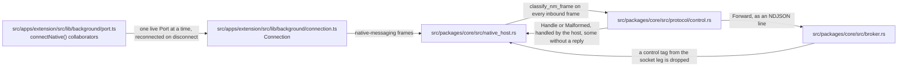
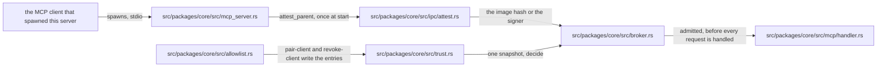
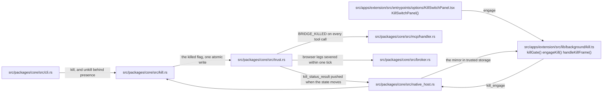
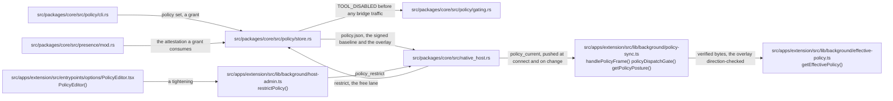
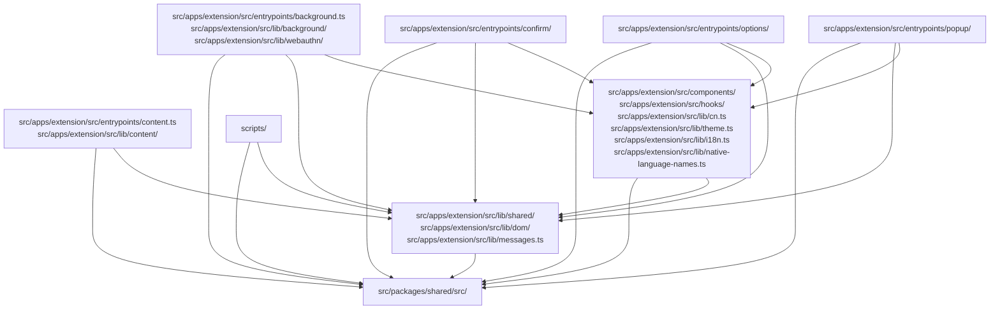

# Architecture: chromium-bridge

> This page is the component structure, the data flows, the protocols, the security model, and the constraints of chromium-bridge, with one diagram per trust boundary. The "why" behind the security decisions is [security/rationale.md](./security/rationale.md).

> Every diagram box that names a file names one that exists and, for TypeScript, symbols it exports; a caption box names an outside actor. `moon run check-architecture` proves existence only, and each diagram's `Demonstrated by:` links resolve to the tests that cover it.

## 1. Architecture overview

```
MCP client A --stdio--> +--------------------------------------------------+
MCP client B --stdio--> | chromium-bridge (MCP server instances)           |
                        |                                                  |
                        |  first instance = BROKER                         |
                        |   - owns the bridge socket + lock file           |
                        |   - admits each harness against the              |
                        |     trusted-client allowlist (attested)          |
                        |   - holds session state, dispatches tools        |
                        |  later instances = relays, attach as clients     |
                        +------------------------+-------------------------+
                                                 | bridge socket: NDJSON over a
                                                 | 0600 Unix-domain socket in a
                                                 | 0700 runtime dir (a user-only
                                                 | named pipe on Windows); same-user
                                                 | check + attestation + HMAC handshake
                                                 v
                        +--------------------------------------------------+
                        | chromium-bridge --native-host  (one per browser, |
                        | spawned by that browser, label e.g. "chrome")    |
                        +------------------------+-------------------------+
                                                 | stdin/stdout, Chrome native
                                                 | messaging (4B LE len + JSON)
                                                 v
                        +--------------------------------------------------+
                        | Chromium Bridge extension (MV3, WXT)             |
                        |  service worker: dispatch, allowlist, masking,   |
                        |    kill-switch mirror, enrollment pin            |
                        |  content script + CDP backend: one shared DOM    |
                        |    implementation (snapshot/click/fill/...)      |
                        |  confirm.html: extension-owned confirmation      |
                        |    window, off the page-reachable DOM            |
                        +------------------------+-------------------------+
                                                 |
                                                 v
                                       the user's real page (logged in)

  Management surface (over the core, never a trust root):
    - the CLI: doctor --fix / uninstall / pair / pair-client / kill / unkill / policy / audit
```

## 2. The processes

| Process | Who starts it | Responsibility | Lifetime |
|------|---------|------|---------|
| MCP server (broker) | The first MCP client to spawn one | Owns the socket and the lock, admits harnesses, holds session state, dispatches tools | Until the last attached harness detaches |
| MCP server (relay) | Each further MCP client | Attests itself to the broker and forwards its harness's calls | Follows its client session |
| native host | Each browser (via the host manifest) | Thin bridge between stdin/stdout NM frames and socket NDJSON; answers control frames (enrollment, kill, client admin, registration repair, policy restriction) itself | Follows the browser extension's Port |
| extension (SW + content) | The browser | Page operations, allowlist, confirmations, masking | The SW restarts about every 5 minutes; the extension follows the browser |

Why separate server and host processes: the browser spawns the native host itself (via the manifest) and the MCP client spawns the MCP server itself. The two are not parent and child, cannot share stdin/stdout, and so need an IPC channel between them.

Why the native host is so thin: all logic lives in the MCP server, so neither an SW restart nor a host restart loses session state. The host is a protocol translator with one addition: it terminates the control plane (enrollment ceremony frames, kill-switch frames, client-admin frames, audit-event forwarding) so those work even when the bridge is down or killed.

Why a broker instead of one server per client: several MCP clients may be configured at once, and the old newest-wins takeover (SIGTERM the previous server) made them fight over the browsers. The first instance now owns the socket; later attested instances attach as relays and share one session, ref-counted so the broker exits when the last harness detaches.

## 3. Protocol layers

### 3.1 Native Messaging (extension <-> native host)

Chrome's official protocol, defined at [developer.chrome.com/native-messaging](https://developer.chrome.com/docs/extensions/develop/concepts/native-messaging).

- Frame format: `4-byte little-endian u32 length` + `UTF-8 JSON`
- Length counts only the JSON bytes, excluding the 4-byte prefix
- Outbound (host -> Chrome) hard limit: 1 MB (exceeding it makes Chrome drop the Port immediately)
- Inbound (Chrome -> host): 64 MB
- Shutdown signal: stdin EOF (not SIGTERM); the host exits gracefully on EOF
- stderr: not shown to the user, but usable for logging (recorded in Chrome's internal logs)
- argv: Chrome appends the caller origin (e.g. `chrome-extension://<id>/`)

Key traps (all handled in the implementation):
- All stdout writes must be single-threaded with a flush per frame (concurrent writes interleave in the pipe buffer and corrupt frames)
- A panic prints to stdout by default and pollutes the stream, so a stderr panic hook is mandatory
- `panic = "abort"` (Cargo profile) + the stderr hook, as a double safety net

### 3.2 MCP JSON-RPC (MCP server <-> MCP client)

Based on JSON-RPC 2.0 over NDJSON, defined at [modelcontextprotocol.io](https://modelcontextprotocol.io/specification/2026-07-28).

- Transport: stdin/stdout, NDJSON (one message per line, LF-terminated)
- Protocol version `2026-07-28`, the stateless revision
- The layer is built on the official Rust SDK ([rmcp](https://github.com/modelcontextprotocol/rust-sdk); the trust-surface decision is in [security/rationale.md](./security/rationale.md#mcp-server-behavior)), with a small shared tokio runtime confined to the MCP serve path.
- Our invariants wrap the SDK: harness attestation and admission pass before serving begins, the kill switch and audit trail run on every tool call, diagnostics stay on stderr (stdout is protocol), and the broker/relay legs are unchanged
- No handshake and no session state: a modern request carries the version and the client capabilities in `params._meta` (`io.modelcontextprotocol/protocolVersion` and `.../clientCapabilities`; rmcp requires both, an empty capabilities object suffices) and is gated per request

| Request | Answer |
|------|------|
| an unsupported version string | JSON-RPC error `-32022` (`UnsupportedProtocolVersionError`) with `data.supported` (the full rmcp set) and `data.requested` |
| incomplete or malformed metadata | `-32602` naming the field(s) |
| a connection's FIRST request that is neither a legacy `initialize` nor a well-formed stateless request | the connection drops without a reply, fail closed |
| a bare `ping` | answered without opening the connection |

- `server/discover` replaces the handshake. Its result declares `supportedVersions` (rmcp's full supported set, newest pinned to `2026-07-28` by a unit test) and `capabilities: {"tools": {}}`.
- Cacheable results (`server/discover`, `tools/list`) carry `ttlMs: 3600000` / `cacheScope: "private"` for peers >= 2026-07-28: the catalogue is static per binary, so one hour bounds staleness across upgrades, and "private" is the conservative scope, since a local single-user server has no shared caches to feed.
- There is no bare-probe form: a `server/discover` without its `_meta` is refused (or, as an opener, dropped); the planned leniency was cut to match the SDK
- Results carry `resultType`; the serverInfo `_meta` rides only the `server/discover` result; tool errors still use `isError: true` inside the result, not a JSON-RPC error, so the model sees the error text and can react
- Handled methods: `server/discover`, `tools/list`, `tools/call`, plus `ping` for legacy peers (answered `{}` pre-open and in initialize-opened sessions; refused after a stateless opener); unknown methods return `-32601` (`initialize` is served in every era as the legacy negotiation - rmcp echoes a supported requested revision and answers an unknown one with the newest)
- **Temporary legacy era**: on a connection opened with `initialize`, a request with no `_meta` version key is served the previous revision's behavior (`initialize` / `notifications/initialized` / `ping` and legacy-shaped tool results) through rmcp's built-in earlier-revision support while Claude Code's 2026-07-28 support rolls out. Once the harness interop smoke shows our harnesses opening with `server/discover`, legacy support is disabled and a missing version key fails closed
- Before any tool call is served, the harness that spawned the server must pass admission against the trusted-client allowlist (section 6 and [trust-boundaries.md](./security/trust-boundaries.md))

### 3.3 Internal bridge protocol (broker <-> native hosts and relays)

Custom, NDJSON over the bridge socket: a 0600 Unix-domain socket inside the 0700 per-user runtime directory on macOS/Linux, a named pipe only the current user can open on Windows (see [SECURITY.md](../.github/SECURITY.md#platform-support)).

Connection setup, in order, each step fail-closed:

1. **Kernel checks** (Unix): the accepting end verifies the peer's UID equals its own and takes a kernel-attested identity of the peer's running executable, which must match its own image (mutual).
2. **HMAC handshake**: the server sends a fresh nonce; the peer answers with `HMAC-SHA256(secret, nonce || 0x00 || label)` over the per-run secret from the lock file, the label present when the peer claims a browser. The secret never crosses the wire; the nonce defeats replay, and a label the MAC does not cover fails verification.
3. **Attach frame**: one mandatory role-declaring frame. A browser's native host attaches as a browser, under the label its handshake response carried (`chrome`, `brave`, ...); a relay attaches with its attested harness identity, which the broker checks against the trusted-client allowlist.

```mermaid
flowchart LR
  peer["a connecting peer: a browser's native host, or a relay"]
  lock["src/packages/core/src/ipc/lockfile.rs"]
  socket["src/packages/core/src/ipc/socket.rs"]
  cred["src/packages/core/src/ipc/peercred.rs"]
  attest["src/packages/core/src/ipc/attest.rs"]
  hs["src/packages/core/src/ipc/handshake.rs"]
  broker["src/packages/core/src/broker.rs"]
  session["src/packages/core/src/session.rs"]
  lock -->|endpoint and per-run secret| peer
  peer -->|connect| socket
  socket -->|same user| cred
  cred -->|same executable image, both ways| attest
  attest -->|HMAC over a fresh nonce and the claimed browser label| hs
  hs -->|attach frame| broker
  broker -->|a browser attach, registered under its label| session
```



The secret from the lock file never crosses the wire, and the nonce is fresh per connection, so a captured reply cannot replay. A relay's attach carries the identity its own `attest_parent` measured; the broker trusts that measurement because the relay passed `attest_peer` first and is therefore this binary. A relay never enters the session: the broker keeps its admission guard and serves its harness against the shared session itself.

Demonstrated by: [session/tests.rs](../src/packages/core/src/session/tests.rs), [broker/tests.rs](../src/packages/core/src/broker/tests.rs), [handshake_verify.rs](../src/packages/core/fuzz/fuzz_targets/handshake_verify.rs), [adversarial.py](../tests/protocol/adversarial.py).

After attach, tool traffic is the `BridgeReq`/`BridgeResp` envelope pair (`src/packages/core/src/protocol.rs`; the Rust types are the wire contract, see section 11):

```typescript
interface BridgeReq {
  id: number;        // monotonically increasing, pairs responses
  op: string;        // operation name, e.g. "tab_list", "page_click"
  browser?: string;  // target browser label (required when several attached)
  args: unknown;     // operation arguments
}

interface BridgeResp {
  id: number;
  ok: boolean;
  data?: unknown;
  error?: string;
}
```

Control frames (enrollment, revocation, kill switch, audit events, policy, language, WebAuthn) ride the native-messaging leg between the extension and its host and are terminated at the host; the same frame kinds arriving from the socket leg are dropped as injections (see [trust-boundaries.md](./security/trust-boundaries.md)).

### 3.4 The native host's frame router



The router is a pure function of the frame, so the handled-versus-forwarded decision is unit-tested without a socket. Bridge requests carry `op` and no `type`, and the socket handshake frames never traverse the pump, so nothing legitimate collides with a control tag.

Demonstrated by: [control/tests.rs](../src/packages/core/src/protocol/control/tests.rs), [native_host/tests.rs](../src/packages/core/src/native_host/tests.rs), [port-routing.test.ts](../src/apps/extension/tests/background/port-routing.test.ts), [cancel_test.ts](../tests/browser/cancel_test.ts).

## 4. Components in detail

### 4.1 The Rust core (`src/packages/core`) and the binary (`src/apps/host`)

The binary is a thin argv dispatch (`src/apps/host/src/main.rs`) over the `chromium-bridge-core` library:

| Module | Responsibility |
|------|------|
| `protocol.rs` | Message types and read/write for the three protocols; the wire-envelope contract; stderr panic hook; SIGPIPE ignore |
| `protocol/control.rs` | The host-handled control frames (enclave, admin, kill switch, audit, browser registration status and repair, policy and its restriction lane, language, WebAuthn) and `classify_nm_frame`, the router that answers them locally and forwards everything else |
| `ipc/` | The bridge socket: platform socket + lockfile + peer credentials + attestation + HMAC handshake, split per concern with platform impls |
| `broker.rs` | Broker ownership, relay attach/detach ref-counting, DoS caps, the kill-switch watcher |
| `session.rs` | Connection registry keyed by browser label; request/response pairing by id; per-connection generation guard; an in-flight guard that cancels an abandoned request at the tool call's deadline |
| `mcp_server.rs` | Default mode: harness admission, JSON-RPC loop, dispatch into the shared session |
| `native_host.rs` | `--native-host` mode: NM frames <-> socket NDJSON, control-plane frame handling, graceful exit on EOF |
| `tools/` | The tool catalogue (26 tools; the cross-process contract source): one `catalogue!` row per tool emits the `BridgeCommand` enum, the `ToolId` index, and the `Tool` record (metadata, grants, dispatch, typed args schema); capabilities are read off the records |
| `runtime_record.rs` | The one loader and writer for every JSON record in the runtime directory: capped read, version envelope, strict parse, atomic 0600 write under the runtime lock |
| `migrations/` | One migration ladder per record, a floor plus its rungs (the rule under the runtime-state table below); the ladders are the only home for compatibility code |
| `allowlist.rs` | The trusted-client allowlist: the entry types, the pairing and revocation writes, and `pair-client` / `revoke-client` / `list-clients` |
| `trust.rs` | The trust record (`trust.json`): the kill latch, the paired clients, the change epoch, and the admission decision every enforcement point takes from one read |
| `kill.rs` | Kill-switch engage/release; release demands a `PresenceAttestation` |
| `presence/` | Proof of user presence for a capability-granting act: a WebAuthn assertion from a credential the act's rule admits (this browser's for a kill release, any enrolled one for enrolling another browser), the extension's confirmation window only where that rule admits none, or the typed phrase on the CLI's terminal; which path vouched is audited per act |
| `webauthn/` | The host as WebAuthn relying party: the statement a tap signs, the registration and assertion parsers, the verifier, and the enrollment store kept in `trust.json` |
| `enclave/` | The host identity key: a P-256 key `pair` mints into the OS credential store (or a 0600 file with `--file-store`), which the extension pins and verifies the signed policy baseline against |
| `audit.rs` | The durable audit trail: bounded 0600 `audit.log`, strict-parsed JSON records, `audit` subcommand reader |
| `registration.rs` + `browsers.rs` | The registration engine and browser-path resolver behind `doctor --fix` and `uninstall` |
| `doctor.rs` | Read-only health report (`doctor` / `status` / `doctor --list`) |
| `error.rs` | Typed `CallError` at the tool-call boundary and the stable `ERROR_SPECS` taxonomy |
| `log.rs` | Leveled stderr logger (`BB_LOG`) and the `log_*!` macros |
| `identity.rs` | The native-messaging host id and the pinned extension key: the single definition site |

### 4.2 The extension (`src/apps/extension`)

Built on WXT (which generates the manifest, including the pinned key) with React UI, TypeScript strict, Vitest + `fakeBrowser` tests. The load-unpacked target is the build output `build/extension/chrome-mv3`, not the source directory.

| Where | Responsibility |
|------|------|
| `src/apps/extension/src/entrypoints/background.ts` | Service-worker entry: native port + reconnect, message router |
| `src/apps/extension/src/entrypoints/content.ts` | Content-script entry: injection guard, op dispatch into the shared DOM layer |
| `src/apps/extension/src/entrypoints/confirm/` | The confirmation window: an extension-owned `chrome-extension://` document the page cannot read, overlay, or click |
| `src/apps/extension/src/entrypoints/options/`, `src/apps/extension/src/entrypoints/popup/` | Settings (Zod-validated, versioned, migrated), the host-admin panels, and the authorization/status popup |
| `src/apps/extension/src/lib/background/` | Dispatch, allowlist store, tabs/CDP backends, cookies, egress masking, kill mirror, enrollment, policy sync |
| `src/apps/extension/src/lib/webauthn/` | The WebAuthn client half of the presence exchange: the ceremony against the browser's authenticator and the frame exchange with the host |
| `src/apps/extension/src/lib/dom/` | The one shared DOM implementation (snapshot/refs/actions); the CDP backend ships its stringified source so the two page backends cannot diverge |
| `src/apps/extension/src/lib/shared/` | Settings schema, message protocol types, allowlist matching |
| `src/apps/extension/src/locales/` | The i18n bundles, one `*.yml` per locale (en, zh_CN, zh_TW); CI enforces key parity |

Trust-state isolation: the enrollment pin, kill mirror, allowlist, and audit ring live in storage confined to extension contexts (`setAccessLevel(TRUSTED_CONTEXTS)`), and the message router refuses security-relevant messages from anything but the extension's own pages.

### 4.3 On-disk artifacts

Registration (written by `doctor --fix` through `registration.rs`):

```
macOS   ~/.chromium-bridge/run-host-<browser>.sh      # wrapper: exec <host> --native-host --label <browser>
        ~/Library/Application Support/<Vendor>/NativeMessagingHosts/
          com.vivswan.chromium_bridge.host.json       # manifest -> that browser's wrapper

Linux   ${XDG_DATA_HOME:-~/.local/share}/chromium-bridge/run-host-<browser>.sh
        ${XDG_CONFIG_HOME:-~/.config}/<vendor>/NativeMessagingHosts/
          com.vivswan.chromium_bridge.host.json

Windows %LOCALAPPDATA%\chromium-bridge\com.vivswan.chromium_bridge.host.json
        HKCU\Software\<Vendor>\NativeMessagingHosts\com.vivswan.chromium_bridge.host
          (Default) = absolute path of the manifest; manifest points at the exe
```

The manifest's `path` points at the registering binary in place (through the wrapper on Unix, because the manifest format has no `args` field); nothing is built, downloaded, or copied. On Windows, Chrome appends the extension origin to the command line, which selects native-host mode.

Runtime state, in the 0700 per-user runtime directory (macOS: `$XDG_RUNTIME_DIR/chromium-bridge` or `~/Library/Application Support/chromium-bridge`; Linux: `$XDG_RUNTIME_DIR/chromium-bridge` with XDG-cache fallback; Windows: `%LOCALAPPDATA%\chromium-bridge`):

| File | Contents |
|------|----------|
| `run.lock` (0600) | The broker's pid and the per-run HMAC secret; the socket rendezvous |
| the bridge socket (0600) | Unix only; no listening port exists |
| `trust.json` (0600) | The trust record: the kill latch, the trusted-client allowlist, the WebAuthn enrollments, and the change epoch |
| `policy.json` (0600) | The host-owned policy: the signed baseline and the unsigned restriction overlay (section 11.3) |
| `policy-history.json` (0600) | Superseded policy revisions, a bounded ring; data for rollback, never authority |
| `lang.json` (0600) | The shared `uiLanguage` preference and its echo-suppression sequence |
| `audit.log` (0600) | The durable audit trail, size-capped |
| `host_key.json` (0600) | The host identity key's scalar, only when the user ran `pair --file-store`; otherwise the key lives in the OS credential store |

Every record loaded through `runtime_record.rs` (`trust.json`, `policy.json`, `policy-history.json`, `lang.json`, and `host_key.json`) carries a `version` envelope and climbs a migration ladder in `src/packages/core/src/migrations/`. The extension's settings store climbs one of the same shape in `src/apps/extension/src/lib/shared/settings-migration.ts`. A ladder is an explicit floor plus an array of rungs, and the current version is derived from both:

```text
FIRST_VERSION = 0                        the version the first rung lifts from
MIGRATIONS    = [rungA, rungB]           the array is the ladder; no rung carries a version, no file name does
CURRENT       = FIRST_VERSION + MIGRATIONS.length

append a rung                           -> CURRENT rises by one
retire rung 0, raise FIRST_VERSION      -> CURRENT unchanged; every stored version keeps its meaning
stored < FIRST_VERSION                  -> too old to climb: a host record is refused, the settings
                                           store is stamped current and salvaged per field
```

The floor is what makes retiring the oldest rung safe. Derived from the rung count alone, every stored version would silently renumber the moment the first rung is deleted, and the wrong rung would run on every existing file. Today every ladder is empty or one no-op rung: this is the shape, not data.

The host identity key lives in the OS credential store (the Keychain, the Credential Manager, or the Secret Service) as the `com.vivswan.chromium-bridge.enclave.signing.v1` entry, qualified by the runtime directory so two directories never share one; `pair --file-store` puts it in `host_key.json` instead.

## 5. Key data flows

### 5.1 One complete tool-call round trip (`page_click(ref="e3")`)

```
1. MCP client -> MCP server (stdin NDJSON):
   {"jsonrpc":"2.0","id":2,"method":"tools/call",
    "params":{"name":"page_click","arguments":{"ref":"e3"},
     "_meta":{"io.modelcontextprotocol/protocolVersion":"2026-07-28",
      "io.modelcontextprotocol/clientCapabilities":{}}}}

2. dispatch checks: harness admitted, epoch fresh, kill switch clear
   -> session.call assigns BridgeReq.id=1, writes to the socket
   (a relay's call reaches the same dispatcher through the broker)

3. native host reads socket NDJSON -> NM frame -> stdout

4. extension SW receives {op:"page_click",args:{ref:"e3"}}
   -> resolve target tab
   -> ensureAllowed(tab.url)   // allowlist; prompts if not authorized
   -> inject content script if needed
   -> content: resolveTarget({ref:"e3"}) -> element
   -> high-risk? (submit/link) -> confirmation window (confirm.html);
      deny/timeout/close all reject
   -> click

5. The result returns along the same path, masked at the SW egress,
   and session pairs it back to the pending call by id.
```

### 5.2 Native host reconnect

```
Browser closes the Port -> host gets stdin EOF -> host exits
Extension onDisconnect -> scheduleReconnect(2s)
connectNative() -> browser re-spawns the host -> host reads the lock file
  -> connects to the socket -> kernel checks + HMAC + attach(label)
Broker accepts -> session re-attaches that label (generation-guarded:
  the superseded connection is severed, so a host still alive on it exits
  and its worker life redials; pending calls of the old connection drain
  as Disconnected)
```

A same-label attach always wins and closes the connection it supersedes. While a browser keeps two worker lives of the extension alive at once, the two lives trade the slot about every 2 s, each redial closing the other, until one life ends.

### 5.3 A second MCP client attaches

```
Client B spawns its own chromium-bridge process
  -> it finds a live broker via the lock file
  -> attests itself over the socket (kernel checks + HMAC + attach frame
     carrying its harness's attested identity)
  -> broker checks the identity against the trust record's paired clients; unmatched fails closed
  -> B's tool calls multiplex through the shared session
Broker exits when the last attached harness detaches.
```

## 6. Security model

The full treatment is in [docs/security/](./security/); this is the map.

| Boundary | Mechanism | Rationale |
|------|------|-----|
| Harness admission (stdio) | Kernel-attested parent identity checked against the trusted-client allowlist; fail-closed once enrolled | [harness admission](./security/rationale.md#harness-admission-and-the-client-allowlist) |
| Bridge socket | 0600 Unix-domain socket in a 0700 dir; peer-UID check; mutual executable attestation; HMAC challenge-response; role-declaring attach | [host identity](./security/rationale.md#host-identity-and-attestation) |
| Any-side revocation | Every host-side enforcement point re-reads `trust.json` before it decides (the extension's kill gate reads its mirror); both credential halves deleted on unpair | [revocation](./security/rationale.md#revocation-and-the-kill-switch) |
| Host identity (host <-> extension) | A P-256 host key minted by `pair`, pinned by the extension after a fingerprint comparison; every signed policy baseline verifies against the pin | [enrollment](./security/rationale.md#enrollment-and-user-presence) |
| User presence (host <-> extension) | A capability-granting act needs a WebAuthn assertion: releasing the kill switch, from a credential enrolled under this browser; enrolling another browser, from any credential already enrolled on the machine. The confirmation window stands in only where that rule admits no credential, so an enrolled browser is never demoted | [user presence](./security/rationale.md#enrollment-and-user-presence) |
| Site allowlist | Per-origin approval + `chrome.permissions.request`; page cannot self-approve | [trust boundaries](./security/trust-boundaries.md) |
| High-risk confirmation | Extension-owned window off the page-reachable DOM; deny on timeout/close | [trust boundaries](./security/trust-boundaries.md) |
| Crown-jewel confirmation | `page_eval` / `page_upload` confirm per call in the extension-owned window; only `page_eval`'s prompt can be waived, by the host policy's `confirmPageEval` opt-out (signed, on a pinned extension); a WebAuthn route for them is not built | [tool risk matrix](./security/tool-risk-matrix.md) |
| Kill switch + audit | Fail-closed latch enforced at four layers; presence-gated release; log-after-decide trail | [kill switch](./security/rationale.md#revocation-and-the-kill-switch) |
| Masking | Cookie/storage/eval/page-text egress masked in the SW, once for both page backends | [tool risk matrix](./security/tool-risk-matrix.md) |
| Protocol safety | NM 1 MB outbound limit; single-writer + flush; stderr panic hook; fuzzed parsers | (section 3.1) |

### 6.1 Harness admission



Authorization keys on the attested anchor, never on the self-asserted client name, which is a log label. Until a trusted-client allowlist exists every harness is admitted and the open posture is logged at ERROR; once it exists an unmatched harness is refused before any tool call.

Demonstrated by: [broker/tests.rs](../src/packages/core/src/broker/tests.rs), [adversarial.py](../tests/protocol/adversarial.py).

### 6.2 User presence over WebAuthn

```mermaid
flowchart LR
  host["src/packages/core/src/native_host.rs"]
  exchange["src/apps/extension/src/lib/webauthn/exchange.ts<br>handleWebAuthnFrame() pendingPresenceRequest() assertPresence()"]
  page["the options page, the RP page the user taps on"]
  ceremony["src/apps/extension/src/lib/webauthn/ceremony.ts<br>requestOptions() assert() browserClient"]
  authenticator["the browser's WebAuthn client and the platform authenticator"]
  verify["src/packages/core/src/webauthn/verify.rs"]
  store["src/packages/core/src/webauthn/store.rs"]
  trust["src/packages/core/src/trust.rs"]
  host -->|presence_request, pushed for a granting act| exchange
  exchange -->|holds the request and opens the page| page
  page -->|the challenge and the allowed credentials| ceremony
  ceremony -->|navigator.credentials.get| authenticator
  authenticator -->|the assertion| ceremony
  ceremony -->|the assertion fields| page
  page -->|the answer| exchange
  exchange -->|presence_assert| host
  host -->|verify against the enrolled key| verify
  verify -->|sign counter advanced| store
  store -->|enrollments| trust
```



The host is the relying party and the extension is the WebAuthn client, with the extension id as the RP ID. Enrollment runs the same exchange with `enroll_begin`, `enroll_options`, `enroll_finish`, and `enroll_result`; the first enrollment on a machine is trust on first use, every later one needs a tap from a credential already enrolled on the machine, under any browser.

The options panel that runs the ceremony and answers is in progress; the background half and the browser suite are in place.

A `presence_confirm` from the confirmation window is accepted only when no enrolled credential could have answered, so an enrolled browser is never demoted to a click.

Demonstrated by: [webauthn/tests.rs](../src/packages/core/src/webauthn/tests.rs), [exchange.test.ts](../src/apps/extension/tests/webauthn/exchange.test.ts), [ceremony.test.ts](../src/apps/extension/tests/webauthn/ceremony.test.ts), [webauthn_test.ts](../tests/browser/webauthn_test.ts).

### 6.3 The kill switch



Nothing clears the latch on its own: no timeout, restart, or reconnect. Release is `chromium-bridge unkill` on a terminal, or the extension's `kill_release`, answered by a WebAuthn tap from a credential enrolled under that browser, or by the confirmation window where that browser enrolled none. A corrupt record refuses both directions, since an unkill from an unknown state would be a fail-open.

Demonstrated by: [kill.test.ts](../src/apps/extension/tests/background/kill.test.ts), [deny-kill.test.ts](../src/apps/extension/tests/background/confirm/deny-kill.test.ts), [broker/tests.rs](../src/packages/core/src/broker/tests.rs), [native_host/tests.rs](../src/packages/core/src/native_host/tests.rs).

## 7. Key constraints (pitfalls hit and handled)

### 7.1 MV3 Service Worker 5-minute restart (Chromium #40733525)
Chrome force-restarts the SW about every 5 minutes, losing in-memory state; the Port closes and the native host exits on stdin EOF. Mitigation: durable state lives in `chrome.storage` (confined to trusted contexts) or in the MCP server process; the SW reconnects on startup; ref markers are stamped onto DOM attributes so the content script rebuilds its map after a restart; pending calls are generation-guarded.

### 7.2 chrome.debugger forces an infobar
Any `chrome.debugger.attach` shows a "Started debugging this browser" banner on every tab while attached. Mitigation: the default snapshot uses a content script and never touches the debugger; `page_snapshot_precise` attaches, reads the a11y tree, and detaches in one handler (detach on the finally path), so the banner flashes for about a second.

### 7.3 The Native Messaging manifest has no args field
The manifest's `path` must be a bare executable. Mitigation: a wrapper script per browser (`run-host-<browser>.sh`) bakes in `--native-host --label <browser>`; the label keys the broker's connection registry.

### 7.4 chrome.permissions.request requires a user gesture
Host permissions can only be requested from a user-gesture context. Mitigation: the allowlist authorization flow goes through the popup; Allow requests the permission and records the entry together.

### 7.5 Static content_scripts conflict with optional permissions
With empty initial host permissions, manifest-declared content scripts never inject. Mitigation: no manifest `content_scripts`; everything injects at runtime via `chrome.scripting.executeScript`, following the granted optional permissions.

### 7.6 Rust panics pollute stdout
Panic messages default to stdout, which corrupts NM frames and MCP NDJSON. Mitigation: `panic = "abort"` in the release profile plus a stderr panic hook, as a double safety net.

### 7.7 page_eval uses the Function constructor, not eval()
`page_eval` must run code in the page's global scope, but the content script runs in a strict-mode closure where `eval` sees the wrong scope. Mitigation: `new Function('"use strict"; return (async () => { <code> })()')()`, which executes in the global scope and supports `return`/`await`. Under CDP mode the same code runs through `Runtime.evaluate` in the page's MAIN world instead.

A reliable execution timeout is impossible in single-threaded JS; the backstop is the tool call's 120 s budget (`CALL_BUDGET` in `src/packages/core/src/tools/mod.rs`). The session has no reply timeout of its own; it only caps the wait for a browser connection at 12 s (`CONNECT_WAIT` in `src/packages/core/src/session.rs`). Results pass through safe serialization (cycles/DOM/exotic types) and masking before leaving the extension.

### 7.8 chrome.debugger restrictions (page_snapshot_precise, CDP mode)
The `chrome.debugger` API is SW-only, cannot attach to `chrome://` or Web Store pages, and allows one debugger per tab (DevTools counts). Mitigation: CDP work happens in the SW; a URL-scheme check filters non-debuggable pages; precise-snapshot refs use a `p` prefix to stay clear of content-script refs; detach is on the finally path.

### 7.9 Cookies are host-bound; storage is same-origin; httpOnly is readable
`chrome.cookies` is bound by host permissions and lives in the SW (it can read `httpOnly`, its core value); page `localStorage`/`sessionStorage` is readable only from a content script on the same origin. Hence `cookie_get` in the SW, `storage_get` in content, both read-only and always masked.

## 8. Technology choices

| Dimension | Choice | Rationale |
|------|------|------|
| Backend language | Rust, single binary + subcommands | Single-file distribution; the host manifest takes an absolute path; one codebase for server, host, and CLI |
| IPC | Unix-domain socket + lock file (a user-only named pipe on Windows) | No listening port; the kernel's peer credentials (the pipe peer's pid on Windows) enable attestation |
| Crypto and parsing | RustCrypto `hmac`/`sha2`, `subtle`, `serde` | Well-adopted libraries over homegrown code; bespoke code only where no library exists |
| Extension platform | MV3 on WXT, React UI, Vitest | Generated manifest with the pinned key; unified `browser.*`; testable SW |
| Contracts | The Rust core generates the TS side | One source of truth; CI fails on drift. See section 11 |
| Engineering gates | moon + proto + GitHub Actions, bun workspace, Biome, cargo-nextest, typos/machete, cargo-deny + the fleet's Trivy and dependency review | One `moon run ci` runs the local cross-platform gate; CI layers additional jobs on top (the repo's jobs live in `.github/workflows/checks.yml`, called inside the managed ci.yml's all-green gate) |
| MCP version | 2026-07-28 (stateless) | The current spec revision, served on the official rmcp SDK: per-request version gate, `server/discover`; rmcp's built-in legacy-era support serves older harnesses during the rollout |

## 9. Known limitations

1. **Snapshot accuracy**: the content-script a11y tree is an approximation (shadow DOM, complex ARIA); `page_snapshot_precise` is the authoritative fallback.
2. **Cross-origin iframes**: the content script cannot read them.
3. **Windows image measurement by path**: the pipe peer's image is hashed from its file path, a residual the [threat model](./security/threat-model.md#residual-risks-accepted-tracked) owns; the gates themselves (user-only pipe, mutual attestation, HMAC, harness admission) hold there as on Unix. See [SECURITY.md](../.github/SECURITY.md#platform-support).
4. **Same-user attacker running our own binary**: kernel attestation distinguishes binaries, not intentions; see the [threat model](./security/threat-model.md) residuals.
5. **Revocation latency to the extension**: the socket leg is immediate; the extension's reflection of a host-key revoke is bounded to the next service-worker wake.

## 10. Extension points

- **Adding a tool**: one catalogue entry + handler in the core, `moon run gen`, an op home in the extension, a risk-matrix row, and tests; the drift guards fail until every surface is covered. The step-by-step list is in [CONTRIBUTING.md](../CONTRIBUTING.md#adding-a-tool).
- **Adding a browser**: one row in the resolver (`browsers.rs`); doctor, --fix, and uninstall pick it up from there.
- **Skill layer**: no architecture change; additive skill files that teach an agent to combine existing tools.

## 11. Protocol boundary contracts: error taxonomy and handshake

The cross-process contracts live in the Rust core, the single source of truth; the TypeScript side is generated from it, and runtime behavior is validated against it. The canonical modules and their derived artifacts:

- **Tool catalogue** (`src/packages/core/src/tools/catalogue.rs`): each tool's name, English model-facing description, JSON-Schema `inputSchema`, and policy metadata (risk / scope / permission / confirmation). `moon run gen` runs the core's `emit_contract` example and `scripts/gen-ops.ts` to produce `src/packages/shared/src/ops.gen.ts`: op names, policy metadata, and a Zod arg validator per tool.
- The `BridgeCommand` request union is inferred from those validators, so the compile-time types and the runtime checks are the same artifact. CI regenerates and fails on any diff, so the checked-in TS cannot drift from the Rust source. UI labels are deliberately NOT part of the contract; they are extension UI copy (`tools.<op>` keys in the extension's `*.yml` locale bundles).
- **Error taxonomy** (`ERROR_SPECS` in `src/packages/core/src/error.rs`): the stable cross-process `code`s with `category`, `retryable`, and the user/model-facing `message`. `CallError::code()` maps the Rust tool-call errors into a subset of the table (`cargo test` enforces membership), and `src/packages/shared/src/errors.gen.ts` gives TS consumers the same code constants (currently unconsumed; see section 11.1).
- **Capabilities** (`src/packages/core/src/tools/capabilities.rs`): the negotiable groupings over the catalogue, emitted into `src/packages/shared/src/protocol.gen.ts`. `cargo test` enforces that every bridge-routed tool is covered by exactly one capability and each capability's permissions equal the union of its tools' permissions.
- **Protocol versions** (`src/packages/core/src/protocol.rs`): the internal bridge protocol integer (`BRIDGE_PROTOCOL_VERSION`) and the MCP JSON-RPC revision the server speaks (`MCP_PROTOCOL_VERSION`, gated per request, declared by `server/discover`, and asserted by the protocol e2e suites), both emitted into `protocol.gen.ts`.
- **Audit forwarding whitelist** (`EXTENSION_AUDIT_KINDS` in `src/packages/core/src/audit.rs`): the extension-owned audit kinds the host accepts over the `audit_event` control frame (`extension_kind` derives from the same list), emitted into `src/packages/shared/src/audit.gen.ts`. The extension's forwarding set and the forwarded prefix of its audit-ring vocabulary build on the generated constant, so the two sides of the forwarding boundary cannot drift apart.
- **Identity** (`src/packages/core/src/identity.rs`): the native-messaging host id and the pinned extension manifest key, emitted into `src/packages/shared/src/identity.gen.ts`. The extension imports `NATIVE_HOST_ID` for `connectNative`, `EXTENSION_MANIFEST_KEY` for the built manifest, and `PINNED_EXTENSION_ID`, derived from the key, for its startup self-check. The registration engine consumes the constants directly, so no installer copy exists to drift.
- **Identity gates**: `moon run check-gen` proves the generated TS fresh (regenerating it re-derives the id from the key), and `scripts/check-extension-id.ts` (`moon run check-extension-id`, part of `moon run ci`) verifies the built manifest and the single-definition-site rule.
- **Host-key signing contract** (`src/packages/core/src/enclave/`: `challenge.rs` for the domain strings and field bounds, `pubkey.rs` and `mod.rs` for the key and signature byte lengths and the `enclave_error` reason codes): emitted by the core's `emit_enclave_contract` example into `src/packages/shared/src/enclave.gen.ts` (constants plus the `EnclaveReasonCode` union the extension's enrollment state machine classifies exhaustively) and `enclave-fixture.gen.ts`.
- The fixture file holds golden vectors: Rust-built message bytes with deterministic software-P256 proofs, replayed through the extension's WebCrypto verifier by `src/apps/extension/tests/background/enclave-golden.test.ts`, so the signed-message encoding itself is pinned across languages. The fixture's signing key is public test data and deny-listed as a host identity on both sides (`ensure_not_fixture_key` in the core, `ENCLAVE_FIXTURE_KEY_ID` in the extension's pairing verifier and stored-pin validators).
- **Policy document and directions** (`src/packages/core/src/policy/`): the host-owned `PolicyDoc`, the fifteen policy fields (the four capability grants, the confirmation policy, `disabledTools`, the confirmation timeouts), their deny defaults, the per-field permissive-direction table, and the `relaxes`/`restricts` comparisons, plus the signed store and the `set_signed`/`restrict` write seams.
- `moon run gen` emits `src/packages/shared/src/policy.gen.ts`: the signing domain constant, the field list with its directions, the defaults, and strict Zod validators for the document, the values, and the restriction overlay. The extension recomputes every direction comparison from the emitted table itself; it never trusts a host's claim about which way a change points.
- A grant is signed by the host key over `UTF8("chromium-bridge-policy-v1") || 0x00 || doc_bytes`, a NUL-separated signing domain beside the host-key challenge domain, injective against it, so no artifact of one ceremony replays as the other.
- There is no canonicalization step anywhere: the host signs and stores the exact document bytes, and the extension verifies the exact bytes it received against its pinned key before strict-parsing those same bytes. Section 11.3 covers the frames that carry all of this.
- **Wire envelopes and control frames** (`BridgeReq` / `BridgeResp` in `src/packages/core/src/protocol.rs`; `EnclaveControl`, `AdminControl`, which embeds `allowlist::ClientEntry`, `PolicyControl` and `WebAuthnControl` in `src/packages/core/src/protocol/control.rs`): the Rust types ARE the contract, and `moon run gen` generates the extension's validators from them into `src/packages/shared/src/envelope.gen.ts`. The table below names each layer and its owner; `moon run check-gen` fails on a stale diff.

| Layer | Owner | What it holds |
|-------|-------|---------------|
| Faithful base, per envelope and host->extension frame | `scripts/gen-envelope.ts` (rules G1-G7, A1-A3; generation aborts rather than emit anything weaker than the Rust parser) | strict objects, required fields required, no invented defaults |
| Enforced validator, the one the extension runs | `src/packages/shared/src/envelope-asymmetries.ts` | the base plus exactly the table's entries, each with its direction and reason; a frame built from one typed verdict (`policy_current`, `enroll_result`, `presence_result`) declares its ok-split here and is emitted as a discriminated union, so a mixture of its arms fails the reader |
| Writer schemas for extension->host frames | `scripts/gen-envelope.ts` | types the constructor sites `satisfies`; the enforcing reader is the Rust serde parser |
| The gate (`moon run check-envelope`) | `scripts/check-envelope.ts` | proves every entry's probes against both validators, holds the inbound classifiers to the reader plan, refuses a hand-written refinement on any reader |
| Behavioral tests of the generated bases | `src/packages/shared/tests/envelope.gen.test.ts` | unknown fields, missing required fields, type confusion, nested extras |

### 11.1 Error taxonomy (ERROR_SPECS)

At the tool-call boundary, Rust's typed error `CallError` maps to the stable `code`s in `ERROR_SPECS` (`src/packages/core/src/error.rs`); `cargo test` validates the mapping. The `code` is for programmatic decisions (it carries `category` and `retryable`); what the model and the user see is the `message`.

| Code | Who assigns it today |
|------|------|
| `EXECUTION_FAILED` | the MCP server, for every free-form failure string the extension reports |
| `TOOL_DISABLED` | the MCP server's policy gate (section 11.3): dispatch refuses a tool whose capability grant is off or that the effective policy disables, before any bridge traffic |
| `NOT_CONNECTED`, `EXTENSION_NOT_READY`, `CONNECTION_LOST`, the admission and revocation refusals, `BRIDGE_KILLED` | the MCP server, with one shared meaning across every process |
| `PROTOCOL_MISMATCH` | nobody yet: it awaits the version/capability handshake wiring (section 11.2) |
| `SITE_NOT_ALLOWED`, `USER_DENIED`, `TAB_NOT_FOUND`, ... | nobody yet: they would need structured error reporting from the extension in place of the free-form strings |

The MCP server (`CallError::code()` in `src/packages/core/src/error.rs`) is the only assigner, covering a subset of the table; the TS constants generated into `errors.gen.ts` exist for future consumers.

### 11.2 Capability / version handshake

Beyond the authentication of section 3.3, connection setup carries a capability and version dimension: the extension side advertises its supported `BRIDGE_PROTOCOL_VERSION` and available capability set (see `src/packages/core/src/tools/capabilities.rs`). The intended behaviour, not yet wired (next paragraph): an incompatible version fails fast with `PROTOCOL_MISMATCH` rather than blowing up later on an unknown op, and a tool whose capability is not advertised is rejected up front.

Honest status: the negotiation is defined in the contract modules and not yet wired, deferred until the binary and the extension can be upgraded independently; the first stage, generation-guarded reconnect (section 5.2), has landed. When it lands, the advertised capability set should derive from the effective policy, which host-owned policy makes possible but does not wire.

Note the three distinct "versions": the MCP JSON-RPC version `2026-07-28` (section 3.2), the internal bridge protocol version (an integer), and the release version (Cargo-sourced). They are all different.

### 11.3 Host-owned policy and language sync

The host owns the security policy: the four capability grants, the confirmation policy, `disabledTools`, and the confirmation timeouts.

The host persists at most one signed baseline plus an unsigned restriction overlay in `runtime_dir()/policy.json`. The state travels over seven additive host-handled control frames (`PolicyControl` in `protocol/control.rs`), classified and terminated exactly like the host-key and admin frames: answered by the host, never forwarded to the MCP server, and dropped when the server leg tries to inject one.



The attestation a grant consumes is the typed phrase on the CLI's terminal, and the host key signs the exact document bytes. The restriction seam refuses an overlay that would relax anything, so the editor's only reachable outcome is a tightening.

Demonstrated by: [store_tests.rs](../src/packages/core/src/policy/store/store_tests.rs), [policy-sync.test.ts](../src/apps/extension/tests/background/policy-sync.test.ts), [policy-swap.test.ts](../src/apps/extension/tests/background/policy-swap.test.ts), [policy-editor.test.tsx](../src/apps/extension/tests/components/policy-editor.test.tsx).

- `policy_get {}` (extension -> host): on-demand refresh. Like every extension-originated frame in this family, it is sent only on a connection where the host has already pushed a frame on the same lane (`policy_current` for the policy frames, `lang_current` for the language ones).
- The never-speak-first rule behind that: an old host would classify an unknown frame as forwardable and the MCP server's strict parse would tear the browser leg down, so against an old host the new frames simply never flow.
- `policy_current { ok, baseline?, sig?, overlay?, error? }` (host -> extension): the policy state, pushed unsolicited at every connect and on every observed store change, and the reply to `policy_get`. The host builds it only through a typed intermediate, so the mixtures the extension must never see cannot be constructed:
  - `ok: true` carries the exact signed baseline bytes (base64, so the signed artifact survives the JSON hop byte-for-byte), the optional signature, and the optional overlay.
  - `ok: false` carries `error` (naming the absent, damaged, or unreadable store, or a malformed `policy_get`) and never a baseline, so the extension fails closed rather than trusting bytes nobody vouched for.
- `policy_restrict { overlay }` (extension -> host) and `policy_restrict_result { ok, error? }` (host -> extension): the options page's policy editor tightening the effective policy through the unsigned restriction seam, which refuses anything that relaxes it; an applied restriction is followed by a `policy_current` carrying the written state, so the result carries the verdict alone. Loosening stays a signed write (`chromium-bridge policy set`).
- `lang_get {}` / `lang_set { value }` (extension -> host) and `lang_current { value, seq }` (host -> extension): the shared `uiLanguage` preference (`runtime_dir()/lang.json`), deliberately outside the signed policy document - not signed, not ratcheted, unable to affect any security decision - with echo suppression by sequence number.

The enforcement contract is asymmetric by design: policy that grants capability carries the host key's signature over the exact bytes and consumed a presence attestation when it was written, while policy that only removes capability travels free as the unsigned overlay. What a same-user process can do to the host key is a residual the [threat model](./security/threat-model.md#residual-risks-accepted-tracked) names.

A machine with no host key has no grant surface: `policy set` refuses up front until `pair` has minted one.

The extension verifies the signature against its own pinned key (never a frame-supplied identity), strict-parses the verified bytes, direction-checks the overlay locally, and keeps a value ratchet in trusted storage: a pinned extension never applies a relaxation without a fresh signature whose signed `touched` set names the relaxed field.

Post-cutover a per-connection dispatch barrier refuses bridge ops until the connection's first policy push has verified and applied, so an op cannot race ahead of a tightening.

On the wire-validation side the seven frames ride the same generated machinery as every other control frame (section 11 above); `policy_current` declares its ok-split in the asymmetry table and is emitted as a discriminated union, proved by the `moon run check-envelope` gate.

The host also enforces its own policy at dispatch (`policy/gating.rs`): a tool whose capability grant is off or that is in `disabledTools` is refused with the stable `TOOL_DISABLED` code before any bridge traffic, with an absent store allowing (pre-cutover) and an unreadable one denying all.

That check is defense in depth for the honest-host path; the extension's gate stays authoritative at its boundary precisely because the host may not be ours.

> To troubleshoot these links at runtime (whether the connection is reachable; whether the lock file, socket, and manifests are in place), use the read-only `chromium-bridge doctor`; see [cli.md](./cli.md).

## 12. The TypeScript module map

Each node is one layer, labelled with the paths it owns; an arrow means the layer imports the other. Rendered from `architecture.yml` by `scripts/render-architecture-map.ts`; `scripts/arch-lint.ts` keeps that declaration equal to the import graph in both directions.

<!-- BEGIN GENERATED: architecture-map (bun scripts/render-architecture-map.ts; derived from architecture.yml) -->

<!-- END GENERATED: architecture-map -->
