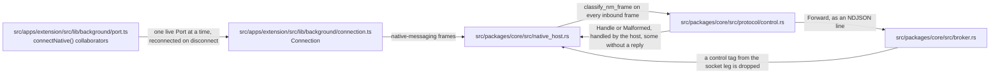
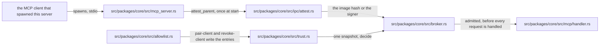
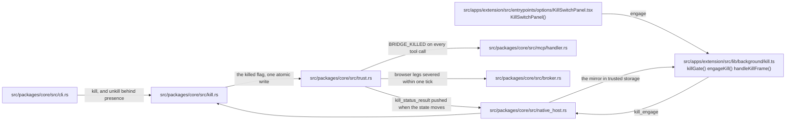
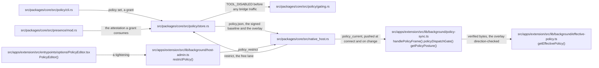
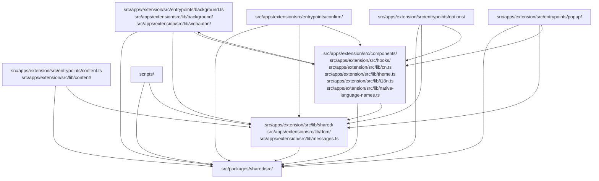

# 架构: chromium-bridge

> 本页描述 chromium-bridge 的组件结构、数据流、协议、安全模型与约束, 每个信任边界配一张图。安全决策背后的「为什么」见 [security/rationale.md](./security/rationale.md)。

> 图中每个标注了文件的方框都指向一个真实存在的文件, 对 TypeScript 而言还包括它导出的符号; 说明性方框则指代外部参与者。`moon run check-architecture` 只证明文件存在, 每张图的 `Demonstrated by:` 链接 (下文的「验证测试:」行) 指向覆盖该图的测试。

## 1. 架构总览

```
MCP client A --stdio--> +--------------------------------------------------+
MCP client B --stdio--> | chromium-bridge (MCP server instances)           |
                        |                                                  |
                        |  first instance = BROKER                         |
                        |   - owns the bridge socket + lock file           |
                        |   - admits each harness against the              |
                        |     trusted-client allowlist (attested)          |
                        |   - holds session state, dispatches tools        |
                        |  later instances = relays, attach as clients     |
                        +------------------------+-------------------------+
                                                 | bridge socket: NDJSON over a
                                                 | 0600 Unix-domain socket in a
                                                 | 0700 runtime dir (a user-only
                                                 | named pipe on Windows); same-user
                                                 | check + attestation + HMAC handshake
                                                 v
                        +--------------------------------------------------+
                        | chromium-bridge --native-host  (one per browser, |
                        | spawned by that browser, label e.g. "chrome")    |
                        +------------------------+-------------------------+
                                                 | stdin/stdout, Chrome native
                                                 | messaging (4B LE len + JSON)
                                                 v
                        +--------------------------------------------------+
                        | Chromium Bridge extension (MV3, WXT)             |
                        |  service worker: dispatch, allowlist, masking,   |
                        |    kill-switch mirror, enrollment pin            |
                        |  content script + CDP backend: one shared DOM    |
                        |    implementation (snapshot/click/fill/...)      |
                        |  confirm.html: extension-owned confirmation      |
                        |    window, off the page-reachable DOM            |
                        +------------------------+-------------------------+
                                                 |
                                                 v
                                       the user's real page (logged in)

  Management surface (over the core, never a trust root):
    - the CLI: doctor --fix / uninstall / pair / pair-client / kill / unkill / policy / audit
```

## 2. 进程

| 进程 | 由谁启动 | 职责 | 生命周期 |
|------|---------|------|---------|
| MCP 服务器 (中介, broker) | 第一个启动它的 MCP 客户端 | 持有套接字与锁文件, 准入各客户端程序 (harness), 保存会话状态, 分发工具调用 | 直到最后一个接入的客户端程序断开 |
| MCP 服务器 (中继) | 之后的每个 MCP 客户端 | 向中介证明自身身份, 并转发其客户端程序的调用 | 跟随其客户端会话 |
| 原生消息主机 | 每个浏览器 (通过主机清单) | stdin/stdout NM 帧与套接字 NDJSON 之间的薄桥接层; 自行应答控制帧 (登记、紧急开关 (kill switch)、客户端管理、注册修复、策略收紧) | 跟随浏览器扩展的 Port |
| 扩展 (SW + 内容脚本) | 浏览器 | 页面操作、站点白名单、确认、脱敏 | SW 约每 5 分钟重启一次; 扩展跟随浏览器 |

为什么服务器与主机是独立进程: 浏览器自己 (通过清单) 启动原生消息主机, MCP 客户端自己启动 MCP 服务器。两者不是父子进程, 无法共享 stdin/stdout, 因此需要一条进程间通信 (IPC) 通道。

为什么原生消息主机如此之薄: 所有逻辑都在 MCP 服务器中, 因此无论 SW 重启还是主机重启都不会丢失会话状态。主机是一个协议翻译器, 只多做一件事: 它终结控制平面 (登记仪式帧、紧急开关帧、客户端管理帧、审计事件转发), 使这些功能在桥接断开或已被紧急关闭时仍然可用。

为什么用中介而不是每个客户端一个服务器: 可能同时配置了多个 MCP 客户端, 旧的「最新者获胜」接管方式 (向前一个服务器发送 SIGTERM) 让它们争抢浏览器。现在第一个实例持有套接字; 之后通过身份证明的实例以中继身份接入并共享同一个会话, 按引用计数管理, 最后一个客户端程序断开时中介退出。

## 3. 协议层

### 3.1 Native Messaging (扩展 <-> 原生消息主机)

Chrome 的官方协议, 定义见 [developer.chrome.com/native-messaging](https://developer.chrome.com/docs/extensions/develop/concepts/native-messaging)。

- 帧格式: `4-byte little-endian u32 length` + `UTF-8 JSON`
- 长度只计 JSON 字节数, 不含 4 字节前缀
- 出站 (主机 -> Chrome) 硬上限: 1 MB (超出会让 Chrome 立即断开 Port)
- 入站 (Chrome -> 主机): 64 MB
- 关闭信号: stdin EOF (不是 SIGTERM); 主机收到 EOF 后优雅退出
- stderr: 不会显示给用户, 但可用于记录日志 (会记入 Chrome 的内部日志)
- argv: Chrome 会追加调用方的源 (origin), 例如 `chrome-extension://<id>/`

主要陷阱 (实现中均已处理):
- 所有 stdout 写入必须单线程进行, 每帧刷新一次 (并发写入会在管道缓冲区中交错, 破坏帧)
- panic 默认打印到 stdout, 会污染数据流, 因此 stderr panic 钩子是必需的
- `panic = "abort"` (Cargo profile) + stderr 钩子, 作为双重保险

### 3.2 MCP JSON-RPC (MCP 服务器 <-> MCP 客户端)

基于 NDJSON 之上的 JSON-RPC 2.0, 定义见 [modelcontextprotocol.io](https://modelcontextprotocol.io/specification/2026-07-28)。

- 传输: stdin/stdout, NDJSON (每行一条消息, 以 LF 结尾)
- 协议版本 `2026-07-28`, 即无状态修订版
- 该层构建在官方 Rust SDK ([rmcp](https://github.com/modelcontextprotocol/rust-sdk); 信任面的决策见 [security/rationale.md](./security/rationale.md#mcp-服务器行为)) 之上, 配一个仅限于 MCP 服务路径的小型共享 tokio 运行时。
- 我们的不变量包裹在 SDK 之外: 客户端程序的身份证明与准入在开始服务前完成, 紧急开关与审计日志在每次工具调用上都运行, 诊断信息只走 stderr (stdout 是协议), 中介/中继两条链路保持不变
- 没有握手, 也没有会话状态: 现代请求在 `params._meta` 中携带版本与客户端能力 (`io.modelcontextprotocol/protocolVersion` 与 `.../clientCapabilities`; rmcp 要求两者都存在, 空的能力对象即可), 并按请求逐一把关

| 请求 | 应答 |
|------|------|
| 不支持的版本字符串 | JSON-RPC 错误 `-32022` (`UnsupportedProtocolVersionError`), 附 `data.supported` (rmcp 支持的全集) 与 `data.requested` |
| 元数据不完整或格式错误 | `-32602`, 并指出有问题的字段 |
| 连接上的第一个请求既不是旧式 `initialize` 也不是格式正确的无状态请求 | 连接直接断开, 不作回复, 失败即关闭 |
| 单独的 `ping` | 直接应答, 不打开连接 |

- `server/discover` 取代了握手。其结果声明 `supportedVersions` (rmcp 支持的全集, 最新版由单元测试固定为 `2026-07-28`) 与 `capabilities: {"tools": {}}`。
- 可缓存的结果 (`server/discover`、`tools/list`) 对 >= 2026-07-28 的对端携带 `ttlMs: 3600000` / `cacheScope: "private"`: 工具目录对每个二进制是静态的, 因此一小时把跨升级的陈旧程度限制住了; 而「private」是保守的作用域, 因为本地单用户服务器没有可供填充的共享缓存。
- 没有裸探测形式: 不带 `_meta` 的 `server/discover` 会被拒绝 (作为连接的首个请求时则直接断开); 原计划的宽松处理已被砍掉, 以与 SDK 保持一致
- 结果携带 `resultType`; serverInfo 的 `_meta` 只随 `server/discover` 的结果返回; 工具错误仍在结果内部用 `isError: true` 表示, 而非 JSON-RPC 错误, 这样模型能看到错误文本并作出反应
- 处理的方法: `server/discover`、`tools/list`、`tools/call`, 外加面向旧式对端的 `ping` (在连接打开前以及由 initialize 打开的会话中应答 `{}`; 在无状态首请求之后则拒绝); 未知方法返回 `-32601` (`initialize` 在每个时代都作为旧式协商被服务 - rmcp 对受支持的请求修订版原样回显, 对未知的则回以最新版)
- **临时的旧式时代**: 在以 `initialize` 打开的连接上, 不带 `_meta` 版本键的请求按上一修订版的行为服务 (`initialize` / `notifications/initialized` / `ping` 以及旧式形态的工具结果), 由 rmcp 内置的早期修订版支持提供, 在 Claude Code 的 2026-07-28 支持铺开期间沿用。一旦客户端程序互操作冒烟测试显示我们的客户端程序以 `server/discover` 打开连接, 旧式支持就会被禁用, 缺少版本键将失败即关闭
- 在服务任何工具调用之前, 启动该服务器的客户端程序必须通过基于受信任客户端白名单的准入 (见第 6 节与 [trust-boundaries.md](./security/trust-boundaries.md))

### 3.3 内部桥接协议 (中介 <-> 原生消息主机与中继)

自定义协议, 在桥接套接字上传输 NDJSON: macOS/Linux 上是 0700 的每用户运行时目录内的 0600 Unix 域套接字, Windows 上是只有当前用户能打开的命名管道 (见 [SECURITY.md](../../.github/SECURITY.md#platform-support))。

连接建立按以下顺序进行, 每一步都失败即关闭:

1. **内核检查** (Unix): 接受端验证对端的 UID 与自己相同, 并获取对端正在运行的可执行文件的由内核证明的身份, 该身份必须与自己的镜像一致 (双向)。
2. **HMAC 握手**: 服务器发送一个新鲜的 nonce; 对端用锁文件中的本次运行密钥回复 `HMAC-SHA256(secret, nonce || 0x00 || label)`, 当对端声明自己是浏览器时才带上标签。密钥从不经过线路; nonce 阻止重放, 而未被 MAC 覆盖的标签无法通过校验。
3. **接入帧**: 一个必需的、声明角色的帧。浏览器的原生消息主机以浏览器身份接入, 标签取自其握手应答所携带的那个 (`chrome`、`brave` 等); 中继以其经证明的客户端程序身份接入, 中介据此核对受信任客户端白名单。


锁文件中的密钥从不经过线路, 且 nonce 每个连接都是新鲜的, 因此截获的回复无法重放。中继的接入帧携带它自己的 `attest_parent` 所测得的身份; 中介信任这个测量结果, 因为中继先通过了 `attest_peer`, 从而证明是同一个二进制。中继从不进入会话: 中介保留自己的准入守卫, 并亲自面向共享会话为中继的客户端程序提供服务。

验证测试: [session/tests.rs](../../src/packages/core/src/session/tests.rs), [broker/tests.rs](../../src/packages/core/src/broker/tests.rs), [handshake_verify.rs](../../src/packages/core/fuzz/fuzz_targets/handshake_verify.rs), [adversarial.py](../../tests/protocol/adversarial.py)。

接入之后, 工具流量采用 `BridgeReq`/`BridgeResp` 信封对 (`src/packages/core/src/protocol.rs`; Rust 类型即线路契约, 见第 11 节):

```typescript
interface BridgeReq {
  id: number;        // monotonically increasing, pairs responses
  op: string;        // operation name, e.g. "tab_list", "page_click"
  browser?: string;  // target browser label (required when several attached)
  args: unknown;     // operation arguments
}

interface BridgeResp {
  id: number;
  ok: boolean;
  data?: unknown;
  error?: string;
}
```

控制帧 (登记、吊销、紧急开关、审计事件、策略、语言、WebAuthn) 走扩展与其主机之间的 Native Messaging 链路, 并在主机处终结; 从套接字链路到达的同类帧会被当作注入丢弃 (见 [trust-boundaries.md](./security/trust-boundaries.md))。

### 3.4 原生消息主机的帧路由



路由器是帧的纯函数, 因此「本地处理还是转发」的判定可以在没有套接字的情况下做单元测试。桥接请求携带 `op` 而没有 `type`, 套接字握手帧也从不经过泵, 所以没有任何合法帧会与控制标签冲突。

验证测试: [control/tests.rs](../../src/packages/core/src/protocol/control/tests.rs), [native_host/tests.rs](../../src/packages/core/src/native_host/tests.rs), [port-routing.test.ts](../../src/apps/extension/tests/background/port-routing.test.ts), [cancel_test.ts](../../tests/browser/cancel_test.ts)。

## 4. 组件详解

### 4.1 Rust 核心 (`src/packages/core`) 与二进制 (`src/apps/host`)

二进制是在 `chromium-bridge-core` 库之上的一层薄 argv 分发 (`src/apps/host/src/main.rs`):

| 模块 | 职责 |
|------|------|
| `protocol.rs` | 三种协议的消息类型与读写; 线路信封契约; stderr panic 钩子; 忽略 SIGPIPE |
| `protocol/control.rs` | 由主机处理的控制帧 (enclave、管理、紧急开关、审计、浏览器注册状态与修复、策略及其收紧通道、语言、WebAuthn) 以及 `classify_nm_frame`, 即在本地应答这些帧并转发其余一切的路由器 |
| `ipc/` | 桥接套接字: 平台套接字 + 锁文件 + 对端凭据 + 身份证明 + HMAC 握手, 按关注点拆分, 各有平台实现 |
| `broker.rs` | 中介所有权、中继接入/断开的引用计数、DoS 上限、紧急开关监视器 |
| `session.rs` | 以浏览器标签为键的连接注册表; 按 id 配对请求/响应; 每连接的代际守卫; 一个在途守卫, 在工具调用的截止时间取消被放弃的请求 |
| `mcp_server.rs` | 默认模式: 客户端程序准入、JSON-RPC 循环、分发到共享会话 |
| `native_host.rs` | `--native-host` 模式: NM 帧 <-> 套接字 NDJSON、控制平面帧处理、EOF 时优雅退出 |
| `tools/` | 工具目录 (26 个工具; 跨进程契约的源头): 每个工具一行 `catalogue!`, 生成 `BridgeCommand` 枚举、`ToolId` 索引与 `Tool` 记录 (元数据、授权、分发、带类型的参数 schema); 能力从这些记录中读出 |
| `runtime_record.rs` | 运行时目录中每个 JSON 记录的唯一加载器与写入器: 有上限的读取、版本信封、严格解析、运行时锁保护下的原子 0600 写入 |
| `migrations/` | 每个记录一条迁移阶梯, 一个底版本加若干阶 (规则见下文运行时状态表之后); 这些阶梯是兼容代码唯一的归宿 |
| `allowlist.rs` | 受信任客户端白名单: 条目类型、配对与吊销写入, 以及 `pair-client` / `revoke-client` / `list-clients` |
| `trust.rs` | 信任记录 (`trust.json`): 紧急开关闩锁、已配对的客户端、变更纪元, 以及每个执行点从一次读取中得出的准入决定 |
| `kill.rs` | 紧急开关的启用/解除; 解除需要 `PresenceAttestation` |
| `presence/` | 授予能力的操作所需的用户在场证明: 来自该操作规则所允许凭据的 WebAuthn 断言 (解除紧急开关用本浏览器的凭据, 登记另一个浏览器用任一已登记的凭据), 仅当该规则不允许任何凭据时才用扩展的确认窗口, 或在 CLI 终端上键入的短语; 由哪条路径担保会按操作逐一审计 |
| `webauthn/` | 作为 WebAuthn 依赖方 (relying party) 的主机: 一次触碰所签署的声明、注册与断言解析器、校验器, 以及保存在 `trust.json` 中的登记存储 |
| `enclave/` | 主机身份密钥: `pair` 铸造到操作系统凭据存储 (或使用 `--file-store` 时的 0600 文件) 中的 P-256 密钥, 扩展固定该密钥并据此验证签名的策略基线 |
| `audit.rs` | 持久审计日志: 有界的 0600 `audit.log`、严格解析的 JSON 记录、`audit` 子命令读取器 |
| `registration.rs` + `browsers.rs` | `doctor --fix` 与 `uninstall` 背后的注册引擎与浏览器路径解析器 |
| `doctor.rs` | 只读健康报告 (`doctor` / `status` / `doctor --list`) |
| `error.rs` | 工具调用边界上带类型的 `CallError` 与稳定的 `ERROR_SPECS` 分类 |
| `log.rs` | 分级 stderr 日志器 (`BB_LOG`) 与 `log_*!` 宏 |
| `identity.rs` | Native Messaging 主机 id 与固定的扩展密钥: 唯一的定义点 |

### 4.2 扩展 (`src/apps/extension`)

基于 WXT 构建 (由它生成清单, 包括固定的密钥), 使用 React UI、TypeScript strict 模式、Vitest + `fakeBrowser` 测试。「加载已解压的扩展程序」的目标是构建输出 `build/extension/chrome-mv3`, 而不是源码目录。

| 位置 | 职责 |
|------|------|
| `src/apps/extension/src/entrypoints/background.ts` | Service Worker 入口: 原生端口 + 重连、消息路由器 |
| `src/apps/extension/src/entrypoints/content.ts` | 内容脚本入口: 注入守卫、将操作分发到共享 DOM 层 |
| `src/apps/extension/src/entrypoints/confirm/` | 确认窗口: 扩展自有的 `chrome-extension://` 文档, 页面无法读取、覆盖或点击 |
| `src/apps/extension/src/entrypoints/options/`, `src/apps/extension/src/entrypoints/popup/` | 设置 (经 Zod 校验、带版本、可迁移)、主机管理面板, 以及授权/状态弹出窗口 |
| `src/apps/extension/src/lib/background/` | 分发、白名单存储、标签页/CDP 后端、Cookie、出口脱敏、紧急开关镜像、登记、策略同步 |
| `src/apps/extension/src/lib/webauthn/` | 在场交换中的 WebAuthn 客户端一半: 面向浏览器认证器的仪式, 以及与主机之间的帧交换 |
| `src/apps/extension/src/lib/dom/` | 唯一的共享 DOM 实现 (快照/引用/操作); CDP 后端携带其字符串化的源码, 使两个页面后端不可能分叉 |
| `src/apps/extension/src/lib/shared/` | 设置 schema、消息协议类型、白名单匹配 |
| `src/apps/extension/src/locales/` | i18n 语言包, 每个语言环境一个 `*.yml` (en、zh_CN、zh_TW); CI 强制键的一致性 |

信任状态隔离: 登记固定值、紧急开关镜像、白名单与审计环都保存在仅限扩展上下文访问的存储中 (`setAccessLevel(TRUSTED_CONTEXTS)`), 消息路由器拒绝来自扩展自有页面之外任何来源的安全相关消息。

### 4.3 磁盘上的产物

注册 (由 `doctor --fix` 通过 `registration.rs` 写入):

```
macOS   ~/.chromium-bridge/run-host-<browser>.sh      # wrapper: exec <host> --native-host --label <browser>
        ~/Library/Application Support/<Vendor>/NativeMessagingHosts/
          com.vivswan.chromium_bridge.host.json       # manifest -> that browser's wrapper

Linux   ${XDG_DATA_HOME:-~/.local/share}/chromium-bridge/run-host-<browser>.sh
        ${XDG_CONFIG_HOME:-~/.config}/<vendor>/NativeMessagingHosts/
          com.vivswan.chromium_bridge.host.json

Windows %LOCALAPPDATA%\chromium-bridge\com.vivswan.chromium_bridge.host.json
        HKCU\Software\<Vendor>\NativeMessagingHosts\com.vivswan.chromium_bridge.host
          (Default) = absolute path of the manifest; manifest points at the exe
```

清单的 `path` 就地指向执行注册的二进制 (Unix 上经由包装脚本, 因为清单格式没有 `args` 字段); 不构建、不下载、不复制任何东西。在 Windows 上, Chrome 会把扩展的源追加到命令行, 由此选中原生消息主机模式。

运行时状态, 位于 0700 的每用户运行时目录中 (macOS: `$XDG_RUNTIME_DIR/chromium-bridge` 或 `~/Library/Application Support/chromium-bridge`; Linux: `$XDG_RUNTIME_DIR/chromium-bridge`, 回退到 XDG 缓存目录; Windows: `%LOCALAPPDATA%\chromium-bridge`):

| 文件 | 内容 |
|------|----------|
| `run.lock` (0600) | 中介的 pid 与本次运行的 HMAC 密钥; 套接字的会合点 |
| 桥接套接字 (0600) | 仅 Unix; 不存在任何监听端口 |
| `trust.json` (0600) | 信任记录: 紧急开关闩锁、受信任客户端白名单、WebAuthn 登记, 以及变更纪元 |
| `policy.json` (0600) | 主机持有的策略: 签名的基线与未签名的限制覆盖层 (第 11.3 节) |
| `policy-history.json` (0600) | 被取代的策略修订版, 一个有界的环; 供回滚用的数据, 绝非权威 |
| `lang.json` (0600) | 共享的 `uiLanguage` 偏好及其回声抑制序号 |
| `audit.log` (0600) | 持久审计日志, 有大小上限 |
| `host_key.json` (0600) | 主机身份密钥的标量, 仅当用户运行了 `pair --file-store` 时存在; 否则密钥保存在操作系统凭据存储中 |

每个通过 `runtime_record.rs` 加载的记录 (`trust.json`、`policy.json`、`policy-history.json`、`lang.json` 与 `host_key.json`) 都带有 `version` 信封, 并沿 `src/packages/core/src/migrations/` 中的迁移阶梯向上爬。扩展的设置存储在 `src/apps/extension/src/lib/shared/settings-migration.ts` 中沿一条同样形状的阶梯爬升。一条阶梯是一个显式的底版本加一个阶的数组, 当前版本由两者推导得出:

```text
FIRST_VERSION = 0                        the version the first rung lifts from
MIGRATIONS    = [rungA, rungB]           the array is the ladder; no rung carries a version, no file name does
CURRENT       = FIRST_VERSION + MIGRATIONS.length

append a rung                           -> CURRENT rises by one
retire rung 0, raise FIRST_VERSION      -> CURRENT unchanged; every stored version keeps its meaning
stored < FIRST_VERSION                  -> too old to climb: a host record is refused, the settings
                                           store is stamped current and salvaged per field
```

底版本是让淘汰最旧一阶变得安全的关键。如果只从阶数推导, 那么删除第一阶的那一刻, 每个已存储的版本号都会悄然重新编号, 每个现有文件都会跑错阶。今天每条阶梯要么为空, 要么只有一个空操作阶: 这是形状, 不是数据。

主机身份密钥保存在操作系统凭据存储 (Keychain、Credential Manager 或 Secret Service) 中, 条目名为 `com.vivswan.chromium-bridge.enclave.signing.v1`, 并以运行时目录加以限定, 因此两个目录绝不会共用一个密钥; `pair --file-store` 则把它放到 `host_key.json` 中。

## 5. 关键数据流

### 5.1 一次完整的工具调用往返 (`page_click(ref="e3")`)

```
1. MCP client -> MCP server (stdin NDJSON):
   {"jsonrpc":"2.0","id":2,"method":"tools/call",
    "params":{"name":"page_click","arguments":{"ref":"e3"},
     "_meta":{"io.modelcontextprotocol/protocolVersion":"2026-07-28",
      "io.modelcontextprotocol/clientCapabilities":{}}}}

2. dispatch checks: harness admitted, epoch fresh, kill switch clear
   -> session.call assigns BridgeReq.id=1, writes to the socket
   (a relay's call reaches the same dispatcher through the broker)

3. native host reads socket NDJSON -> NM frame -> stdout

4. extension SW receives {op:"page_click",args:{ref:"e3"}}
   -> resolve target tab
   -> ensureAllowed(tab.url)   // allowlist; prompts if not authorized
   -> inject content script if needed
   -> content: resolveTarget({ref:"e3"}) -> element
   -> high-risk? (submit/link) -> confirmation window (confirm.html);
      deny/timeout/close all reject
   -> click

5. The result returns along the same path, masked at the SW egress,
   and session pairs it back to the pending call by id.
```

### 5.2 原生消息主机重连

```
Browser closes the Port -> host gets stdin EOF -> host exits
Extension onDisconnect -> scheduleReconnect(2s)
connectNative() -> browser re-spawns the host -> host reads the lock file
  -> connects to the socket -> kernel checks + HMAC + attach(label)
Broker accepts -> session re-attaches that label (generation-guarded:
  pending calls of the old connection drain as Disconnected)
```

### 5.3 第二个 MCP 客户端接入

```
Client B spawns its own chromium-bridge process
  -> it finds a live broker via the lock file
  -> attests itself over the socket (kernel checks + HMAC + attach frame
     carrying its harness's attested identity)
  -> broker checks the identity against the trust record's paired clients; unmatched fails closed
  -> B's tool calls multiplex through the shared session
Broker exits when the last attached harness detaches.
```

## 6. 安全模型

完整论述见 [docs/security/](./security/); 这里是导览图。

| 边界 | 机制 | 依据 |
|------|------|-----|
| 客户端程序准入 (stdio) | 由内核证明的父进程身份, 对照受信任客户端白名单核对; 一旦登记即失败即关闭 | [客户端程序准入](./security/rationale.md#客户端程序准入与客户端白名单) |
| 桥接套接字 | 0700 目录中的 0600 Unix 域套接字; 对端 UID 检查; 双向可执行文件证明; HMAC 质询-应答; 声明角色的接入帧 | [主机身份](./security/rationale.md#主机身份与证明) |
| 任一侧吊销 | 主机侧的每个执行点在决策前重新读取 `trust.json` (扩展的紧急开关门禁读取其镜像); 取消配对时删除凭据的两半 | [吊销](./security/rationale.md#吊销与紧急开关) |
| 主机身份 (主机 <-> 扩展) | 由 `pair` 铸造的 P-256 主机密钥, 扩展在比对指纹后将其固定; 每个签名的策略基线都对照该固定值验证 | [登记](./security/rationale.md#登记与用户在场) |
| 用户在场 (主机 <-> 扩展) | 授予能力的操作需要 WebAuthn 断言: 解除紧急开关, 用在本浏览器下登记的凭据; 登记另一个浏览器, 用本机上任一已登记的凭据。仅当该规则不允许任何凭据时才由确认窗口代替, 因此已登记的浏览器绝不会被降级 | [用户在场](./security/rationale.md#登记与用户在场) |
| 站点白名单 | 按源逐一批准 + `chrome.permissions.request`; 页面无法自行批准 | [信任边界](./security/trust-boundaries.md) |
| 高风险确认 | 扩展自有的窗口, 不在页面可触及的 DOM 中; 超时/关闭即拒绝 | [信任边界](./security/trust-boundaries.md) |
| 核心资产确认 | `page_eval` / `page_upload` 每次调用都在扩展自有窗口中确认; 只有 `page_eval` 的提示可以豁免, 通过主机策略的 `confirmPageEval` 选择退出 (在已固定的扩展上为签名策略); 它们没有 WebAuthn 路径 | [工具风险矩阵](./security/tool-risk-matrix.md) |
| 紧急开关 + 审计 | 在四个层面执行的失败即关闭闩锁; 由在场把关的解除; 先决策后记录的日志 | [紧急开关](./security/rationale.md#吊销与紧急开关) |
| 脱敏 | Cookie/存储/eval/页面文本的出口在 SW 中脱敏, 对两个页面后端只做一次 | [工具风险矩阵](./security/tool-risk-matrix.md) |
| 协议安全 | NM 1 MB 出站上限; 单写入者 + 刷新; stderr panic 钩子; 经模糊测试的解析器 | (第 3.1 节) |

### 6.1 客户端程序准入



授权以经证明的锚点为键, 绝不以客户端自报的名称为键, 后者只是日志标签。在受信任客户端白名单存在之前, 每个客户端程序都被准入, 并以 ERROR 级别记录这种开放姿态; 白名单一旦存在, 不匹配的客户端程序会在任何工具调用之前被拒绝。

验证测试: [broker/tests.rs](../../src/packages/core/src/broker/tests.rs), [adversarial.py](../../tests/protocol/adversarial.py)。

### 6.2 基于 WebAuthn 的用户在场

```mermaid
flowchart LR
  host["src/packages/core/src/native_host.rs"]
  exchange["src/apps/extension/src/lib/webauthn/exchange.ts<br>handleWebAuthnFrame() pendingPresenceRequest() assertPresence()"]
  page["the options page, the RP page the user taps on"]
  ceremony["src/apps/extension/src/lib/webauthn/ceremony.ts<br>requestOptions() assert() browserClient"]
  authenticator["the browser's WebAuthn client and the platform authenticator"]
  verify["src/packages/core/src/webauthn/verify.rs"]
  store["src/packages/core/src/webauthn/store.rs"]
  trust["src/packages/core/src/trust.rs"]
  host -->|presence_request, pushed for a granting act| exchange
  exchange -->|holds the request and opens the page| page
  page -->|the challenge and the allowed credentials| ceremony
  ceremony -->|navigator.credentials.get| authenticator
  authenticator -->|the assertion| ceremony
  ceremony -->|the assertion fields| page
  page -->|the answer| exchange
  exchange -->|presence_assert| host
  host -->|verify against the enrolled key| verify
  verify -->|sign counter advanced| store
  store -->|enrollments| trust
```



主机是依赖方, 扩展是 WebAuthn 客户端, 以扩展 id 作为 RP ID。登记走同一套交换流程, 使用 `enroll_begin`、`enroll_options`、`enroll_finish` 与 `enroll_result`; 一台机器上的首次登记是首次使用即信任, 此后的每次登记都需要来自本机已登记凭据的一次触碰, 不限浏览器。

运行该仪式并作答的选项页面板尚在开发中; 后台一半与浏览器测试套件已就位。

只有在没有任何已登记凭据能够作答时, 才接受来自确认窗口的 `presence_confirm`, 因此已登记的浏览器绝不会被降级为一次点击。

验证测试: [webauthn/tests.rs](../../src/packages/core/src/webauthn/tests.rs), [exchange.test.ts](../../src/apps/extension/tests/webauthn/exchange.test.ts), [ceremony.test.ts](../../src/apps/extension/tests/webauthn/ceremony.test.ts), [webauthn_test.ts](../../tests/browser/webauthn_test.ts)。

### 6.3 紧急开关



没有任何东西会自行清除这个闩锁: 没有超时、重启或重连能做到。解除的方式是在终端上运行 `chromium-bridge unkill`, 或者使用扩展的 `kill_release`, 由在该浏览器下登记的凭据以 WebAuthn 触碰应答, 或者在该浏览器未登记任何凭据时由确认窗口应答。损坏的记录会拒绝两个方向的操作, 因为从未知状态执行解除将是失败即开放。

验证测试: [kill.test.ts](../../src/apps/extension/tests/background/kill.test.ts), [deny-kill.test.ts](../../src/apps/extension/tests/background/confirm/deny-kill.test.ts), [broker/tests.rs](../../src/packages/core/src/broker/tests.rs), [native_host/tests.rs](../../src/packages/core/src/native_host/tests.rs)。

## 7. 关键约束 (踩过并处理的坑)

### 7.1 MV3 Service Worker 每 5 分钟重启 (Chromium #40733525)
Chrome 大约每 5 分钟强制重启一次 SW, 内存状态随之丢失; Port 关闭, 原生消息主机因 stdin EOF 而退出。缓解: 持久状态保存在 `chrome.storage` (仅限受信任上下文) 或 MCP 服务器进程中; SW 启动时重连; 引用标记被盖在 DOM 属性上, 使内容脚本能在重启后重建其映射; 在途调用受代际守卫保护。

### 7.2 chrome.debugger 会强制显示横幅
任何 `chrome.debugger.attach` 在附加期间都会在每个标签页上显示「Started debugging this browser」横幅。缓解: 默认快照使用内容脚本, 从不触碰调试器; `page_snapshot_precise` 在一个处理函数中完成附加、读取无障碍树、分离 (在 finally 路径上分离), 因此横幅只闪现大约一秒。

### 7.3 Native Messaging 清单没有 args 字段
清单的 `path` 必须是一个裸可执行文件。缓解: 每个浏览器一个包装脚本 (`run-host-<browser>.sh`), 把 `--native-host --label <browser>` 固化进去; 该标签是中介连接注册表的键。

### 7.4 chrome.permissions.request 需要用户手势
主机权限只能在用户手势上下文中请求。缓解: 白名单授权流程经由弹出窗口完成; 点击「允许」会同时请求权限并记录条目。

### 7.5 静态 content_scripts 与可选权限冲突
初始主机权限为空时, 清单中声明的内容脚本永远不会注入。缓解: 清单中不写 `content_scripts`; 一切都在运行时通过 `chrome.scripting.executeScript` 注入, 跟随已授予的可选权限。

### 7.6 Rust panic 会污染 stdout
panic 消息默认输出到 stdout, 会破坏 NM 帧与 MCP NDJSON。缓解: release profile 中的 `panic = "abort"` 加上 stderr panic 钩子, 作为双重保险。

### 7.7 page_eval 使用 Function 构造函数而非 eval()
`page_eval` 必须在页面的全局作用域中运行代码, 但内容脚本运行在严格模式闭包中, 其中 `eval` 看到的是错误的作用域。缓解: `new Function('"use strict"; return (async () => { <code> })()')()`, 它在全局作用域中执行, 并支持 `return`/`await`。在 CDP 模式下, 同样的代码改为通过 `Runtime.evaluate` 在页面的 MAIN world 中运行。

在单线程 JS 中, 可靠的执行超时是不可能的; 兜底是工具调用的 120 s 预算 (`src/packages/core/src/tools/mod.rs` 中的 `CALL_BUDGET`)。会话本身没有回复超时; 它只把等待浏览器连接的时间限制在 12 s (`src/packages/core/src/session.rs` 中的 `CONNECT_WAIT`)。结果在离开扩展之前会经过安全序列化 (循环引用/DOM/特殊类型) 与脱敏。

### 7.8 chrome.debugger 的限制 (page_snapshot_precise、CDP 模式)
`chrome.debugger` API 只能在 SW 中使用, 无法附加到 `chrome://` 或 Web Store 页面, 并且每个标签页只允许一个调试器 (DevTools 也算)。缓解: CDP 工作在 SW 中进行; URL 协议检查过滤掉不可调试的页面; 精确快照的引用使用 `p` 前缀, 以与内容脚本的引用区分开; 分离放在 finally 路径上。

### 7.9 Cookie 绑定主机名; 存储同源; httpOnly 可读
`chrome.cookies` 受主机权限约束并运行在 SW 中 (它能读取 `httpOnly`, 这正是它的核心价值); 页面的 `localStorage`/`sessionStorage` 只能由同源的内容脚本读取。因此 `cookie_get` 在 SW 中, `storage_get` 在内容脚本中, 两者都只读且始终脱敏。

## 8. 技术选型

| 维度 | 选择 | 依据 |
|------|------|------|
| 后端语言 | Rust, 单一二进制 + 子命令 | 单文件分发; 主机清单接受绝对路径; 服务器、主机与 CLI 共用一套代码 |
| IPC | Unix 域套接字 + 锁文件 (Windows 上为仅限当前用户的命名管道) | 没有监听端口; 内核的对端凭据 (Windows 上是管道对端的 pid) 使身份证明成为可能 |
| 加密与解析 | RustCrypto `hmac`/`sha2`、`subtle`、`serde` | 优先选择被广泛采用的库而非自研代码; 只有在没有现成库时才写定制代码 |
| 扩展平台 | 基于 WXT 的 MV3、React UI、Vitest | 生成的清单带固定密钥; 统一的 `browser.*`; 可测试的 SW |
| 契约 | Rust 核心生成 TS 侧 | 单一事实来源; CI 在出现漂移时失败。见第 11 节 |
| 工程门禁 | moon + proto + GitHub Actions、bun 工作区、Biome、cargo-nextest、typos/machete、cargo-deny + 车队共用的 Trivy 与依赖审查 | 一条 `moon run ci` 运行本地跨平台门禁; CI 在其上叠加额外任务 (仓库自己的任务位于 `.github/workflows/checks.yml`, 在受管的 ci.yml 的 all-green 门禁内被调用) |
| MCP 版本 | 2026-07-28 (无状态) | 当前的规范修订版, 基于官方 rmcp SDK 提供服务: 按请求的版本把关、`server/discover`; rmcp 内置的旧式时代支持在铺开期间为较旧的客户端程序提供服务 |

## 9. 已知限制

1. **快照准确性**: 内容脚本的无障碍树是近似的 (shadow DOM、复杂的 ARIA); `page_snapshot_precise` 是权威的回退方案。
2. **跨源 iframe**: 内容脚本无法读取它们。
3. **Windows 上按路径测量镜像**: 管道对端的镜像按其文件路径进行哈希, 这是[威胁模型](./security/threat-model.md#残余风险-已接受已跟踪)所认领的残余风险; 门禁本身 (仅限当前用户的管道、双向证明、HMAC、客户端程序准入) 在那里与 Unix 上一样成立。见 [SECURITY.md](../../.github/SECURITY.md#platform-support)。
4. **运行我们自己二进制的同用户攻击者**: 内核证明区分的是二进制而非意图; 见[威胁模型](./security/threat-model.md)中的残余风险。
5. **到扩展的吊销延迟**: 套接字链路是即时的; 扩展对主机密钥吊销的反映最迟在下一次 Service Worker 唤醒时完成。

## 10. 扩展点

- **添加一个工具**: 在核心中加一条目录条目 + 处理函数, 运行 `moon run gen`, 在扩展中为该操作安家, 加一行风险矩阵, 再加测试; 在每个面都覆盖到之前, 漂移守卫会一直失败。分步清单见 [CONTRIBUTING.md](../../CONTRIBUTING.md#adding-a-tool)。
- **添加一个浏览器**: 在解析器 (`browsers.rs`) 中加一行; doctor、--fix 与 uninstall 会从那里自动识别它。
- **技能层**: 不改架构; 以增量的技能文件教会代理组合现有工具。

## 11. 协议边界契约: 错误分类与握手

跨进程契约位于 Rust 核心, 它是单一事实来源; TypeScript 侧由它生成, 运行时行为也对照它验证。规范模块及其派生产物如下:

- **工具目录** (`src/packages/core/src/tools/catalogue.rs`): 每个工具的名称、面向模型的英文描述、JSON-Schema `inputSchema`, 以及策略元数据 (风险 / 范围 / 权限 / 确认)。`moon run gen` 运行核心的 `emit_contract` 示例与 `scripts/gen-ops.ts`, 生成 `src/packages/shared/src/ops.gen.ts`: 操作名、策略元数据, 以及每个工具一个 Zod 参数校验器。
- `BridgeCommand` 请求联合类型由这些校验器推断得出, 因此编译期类型与运行时检查是同一份产物。CI 会重新生成并在出现任何差异时失败, 所以签入的 TS 不可能偏离 Rust 源头。UI 标签刻意不属于契约; 它们是扩展的 UI 文案 (扩展 `*.yml` 语言包中的 `tools.<op>` 键)。
- **错误分类** (`src/packages/core/src/error.rs` 中的 `ERROR_SPECS`): 稳定的跨进程 `code`, 附带 `category`、`retryable` 以及面向用户/模型的 `message`。`CallError::code()` 把 Rust 的工具调用错误映射到该表的一个子集 (`cargo test` 强制成员关系), 而 `src/packages/shared/src/errors.gen.ts` 为 TS 消费者提供同样的代码常量 (目前尚无消费者; 见第 11.1 节)。
- **能力** (`src/packages/core/src/tools/capabilities.rs`): 工具目录之上可协商的分组, 生成到 `src/packages/shared/src/protocol.gen.ts`。`cargo test` 强制每个经桥接路由的工具恰好被一个能力覆盖, 且每个能力的权限等于其工具权限的并集。
- **协议版本** (`src/packages/core/src/protocol.rs`): 内部桥接协议的整数版本 (`BRIDGE_PROTOCOL_VERSION`) 与服务器所讲的 MCP JSON-RPC 修订版 (`MCP_PROTOCOL_VERSION`, 按请求把关, 由 `server/discover` 声明, 并由协议 e2e 测试套件断言), 两者都生成到 `protocol.gen.ts`。
- **审计转发白名单** (`src/packages/core/src/audit.rs` 中的 `EXTENSION_AUDIT_KINDS`): 主机通过 `audit_event` 控制帧接受的、由扩展拥有的审计种类 (`extension_kind` 由同一列表派生), 生成到 `src/packages/shared/src/audit.gen.ts`。扩展的转发集合及其审计环词汇表中被转发的前缀都建立在生成的常量之上, 因此转发边界的两侧不可能分叉。
- **身份** (`src/packages/core/src/identity.rs`): Native Messaging 主机 id 与固定的扩展清单密钥, 生成到 `src/packages/shared/src/identity.gen.ts`。扩展导入 `NATIVE_HOST_ID` 用于 `connectNative`, 导入 `EXTENSION_MANIFEST_KEY` 用于构建出的清单, 导入由该密钥派生的 `PINNED_EXTENSION_ID` 用于启动自检。注册引擎直接消费这些常量, 因此不存在可能漂移的安装程序副本。
- **身份门禁**: `moon run check-gen` 证明生成的 TS 是新鲜的 (重新生成会从密钥重新推导出 id), `scripts/check-extension-id.ts` (`moon run check-extension-id`, `moon run ci` 的一部分) 验证构建出的清单以及唯一定义点规则。
- **主机密钥签名契约** (`src/packages/core/src/enclave/`: `challenge.rs` 定义域字符串与字段边界, `pubkey.rs` 与 `mod.rs` 定义密钥与签名的字节长度以及 `enclave_error` 原因码): 由核心的 `emit_enclave_contract` 示例生成到 `src/packages/shared/src/enclave.gen.ts` (常量加上 `EnclaveReasonCode` 联合类型, 扩展的登记状态机对其做穷举分类) 与 `enclave-fixture.gen.ts`。
- 夹具文件保存黄金向量: 由 Rust 构建的消息字节, 配上确定性的软件 P256 证明, 由 `src/apps/extension/tests/background/enclave-golden.test.ts` 通过扩展的 WebCrypto 校验器回放, 从而把签名消息的编码本身跨语言固定下来。夹具的签名密钥是公开的测试数据, 在两侧都被列入主机身份的拒绝名单 (核心中的 `ensure_not_fixture_key`, 扩展配对校验器与已存固定值校验器中的 `ENCLAVE_FIXTURE_KEY_ID`)。
- **策略文档与方向** (`src/packages/core/src/policy/`): 主机持有的 `PolicyDoc`、十五个策略字段 (四项能力授予、确认策略、`disabledTools`、确认超时)、它们的默认拒绝值、逐字段的宽松方向表、`relaxes`/`restricts` 比较, 以及签名存储和 `set_signed`/`restrict` 写入接缝。
- `moon run gen` 生成 `src/packages/shared/src/policy.gen.ts`: 签名域常量、带方向的字段列表、默认值, 以及针对文档、取值与限制覆盖层的严格 Zod 校验器。扩展自己根据生成的表重新计算每一次方向比较; 它从不相信主机关于某次变更朝向哪边的说法。
- 授予由主机密钥对 `UTF8("chromium-bridge-policy-v1") || 0x00 || doc_bytes` 签名, 这是与主机密钥质询域并列的一个以 NUL 分隔的签名域, 相对于它是单射的, 因此一个仪式的产物无法重放为另一个。
- 任何地方都没有规范化步骤: 主机签名并存储精确的文档字节, 扩展先对照其固定密钥验证收到的精确字节, 再对这些相同的字节做严格解析。第 11.3 节介绍承载这一切的帧。
- **线路信封与控制帧** (`src/packages/core/src/protocol.rs` 中的 `BridgeReq` / `BridgeResp`; `src/packages/core/src/protocol/control.rs` 中的 `EnclaveControl`、`AdminControl` (它内嵌 `allowlist::ClientEntry`)、`PolicyControl` 与 `WebAuthnControl`): Rust 类型就是契约, `moon run gen` 据此为扩展生成校验器到 `src/packages/shared/src/envelope.gen.ts`。下表列出每一层及其归属; `moon run check-gen` 在差异过期时失败。

| 层 | 归属 | 内容 |
|-------|-------|---------------|
| 忠实基线, 每个信封与每个主机->扩展帧一份 | `scripts/gen-envelope.ts` (规则 G1-G7、A1-A3; 生成宁可中止也不输出任何比 Rust 解析器更弱的东西) | 严格对象, 必填字段必填, 不杜撰默认值 |
| 强制校验器, 扩展实际运行的那个 | `src/packages/shared/src/envelope-asymmetries.ts` | 基线加上恰好表中的那些条目, 每条带方向与理由; 由一个带类型的裁决构建的帧 (`policy_current`、`enroll_result`、`presence_result`) 在此声明其 ok 分裂, 并被生成为可区分联合类型, 因此混合其分支的帧会被读取方拒绝 |
| 扩展->主机帧的写入方 schema | `scripts/gen-envelope.ts` | 供构造点 `satisfies` 的类型; 执行约束的读取方是 Rust serde 解析器 |
| 门禁 (`moon run check-envelope`) | `scripts/check-envelope.ts` | 对两个校验器证明每个条目的探针, 让入站分类器遵守读取方计划, 拒绝任何读取方上手写的细化 |
| 生成基线的行为测试 | `src/packages/shared/tests/envelope.gen.test.ts` | 未知字段、缺失必填字段、类型混淆、嵌套多余字段 |

### 11.1 错误分类 (ERROR_SPECS)

在工具调用边界上, Rust 的类型化错误 `CallError` 映射到 `ERROR_SPECS` (`src/packages/core/src/error.rs`) 中的稳定 `code`; `cargo test` 验证该映射。`code` 用于程序化决策 (它携带 `category` 与 `retryable`); 模型与用户看到的是 `message`。

| 代码 | 今天由谁赋予 |
|------|------|
| `EXECUTION_FAILED` | MCP 服务器, 用于扩展报告的每个自由格式失败字符串 |
| `TOOL_DISABLED` | MCP 服务器的策略门禁 (第 11.3 节): 分发在任何桥接流量之前拒绝能力授予已关闭或被有效策略禁用的工具 |
| `NOT_CONNECTED`、`EXTENSION_NOT_READY`、`CONNECTION_LOST`、准入与吊销拒绝、`BRIDGE_KILLED` | MCP 服务器, 在每个进程中含义一致 |
| `PROTOCOL_MISMATCH` | 尚无: 它等待版本/能力握手接线完成 (第 11.2 节) |
| `SITE_NOT_ALLOWED`、`USER_DENIED`、`TAB_NOT_FOUND`... | 尚无: 它们需要扩展用结构化错误报告取代自由格式字符串 |

MCP 服务器 (`src/packages/core/src/error.rs` 中的 `CallError::code()`) 是唯一的赋予者, 只覆盖该表的一个子集; 生成到 `errors.gen.ts` 的 TS 常量是为将来的消费者准备的。

### 11.2 能力 / 版本握手

在第 3.3 节的身份验证之外, 连接建立还带有能力与版本维度: 扩展侧通告其支持的 `BRIDGE_PROTOCOL_VERSION` 与可用的能力集合 (见 `src/packages/core/src/tools/capabilities.rs`)。预期行为 (尚未接线, 见下一段): 不兼容的版本以 `PROTOCOL_MISMATCH` 快速失败, 而不是稍后在未知操作上炸掉; 能力未被通告的工具则预先拒绝。

如实说明现状: 协商已在契约模块中定义, 但尚未接线, 推迟到二进制与扩展可以独立升级之时; 第一阶段, 即受代际守卫保护的重连 (第 5.2 节), 已经落地。待它落地时, 通告的能力集合应从有效策略推导, 主机持有的策略使这成为可能, 但尚未接线。

注意三个不同的「版本」: MCP JSON-RPC 版本 `2026-07-28` (第 3.2 节)、内部桥接协议版本 (一个整数), 以及发布版本 (来自 Cargo)。它们各不相同。

### 11.3 主机持有的策略与语言同步

主机持有安全策略: 四项能力授予、确认策略、`disabledTools` 与确认超时。

主机在 `runtime_dir()/policy.json` 中最多持久化一个签名的基线加一个未签名的限制覆盖层。状态通过七个增量的、由主机处理的控制帧 (`protocol/control.rs` 中的 `PolicyControl`) 传递, 其分类与终结方式与主机密钥帧和管理帧完全一致: 由主机应答, 从不转发给 MCP 服务器, 当服务器链路试图注入时直接丢弃。



授予所消耗的在场证明是在 CLI 终端上键入的短语, 主机密钥对精确的文档字节签名。限制接缝拒绝任何会放宽内容的覆盖层, 因此编辑器唯一能达成的结果就是收紧。

验证测试: [store_tests.rs](../../src/packages/core/src/policy/store/store_tests.rs), [policy-sync.test.ts](../../src/apps/extension/tests/background/policy-sync.test.ts), [policy-swap.test.ts](../../src/apps/extension/tests/background/policy-swap.test.ts), [policy-editor.test.tsx](../../src/apps/extension/tests/components/policy-editor.test.tsx)。

- `policy_get {}` (扩展 -> 主机): 按需刷新。与这一族中每个由扩展发起的帧一样, 它只在主机已经在同一通道上推送过帧的连接上发送 (策略帧对应 `policy_current`, 语言帧对应 `lang_current`)。
- 其背后的「绝不先开口」规则: 旧主机会把未知帧归类为可转发, 而 MCP 服务器的严格解析会拆掉浏览器链路, 因此面对旧主机, 新帧根本不会流动。
- `policy_current { ok, baseline?, sig?, overlay?, error? }` (主机 -> 扩展): 策略状态, 在每次连接时以及每次观察到存储变更时主动推送, 也是对 `policy_get` 的回复。主机只通过一个带类型的中间形态构建它, 因此扩展绝不该看到的混合形态根本无法构造出来:
  - `ok: true` 携带精确的签名基线字节 (base64, 使签名产物逐字节地经过 JSON 跳转而不变)、可选的签名, 以及可选的覆盖层。
  - `ok: false` 携带 `error` (指明存储缺失、损坏或不可读, 或 `policy_get` 格式错误), 绝不携带基线, 因此扩展失败即关闭, 而不是信任无人担保的字节。
- `policy_restrict { overlay }` (扩展 -> 主机) 与 `policy_restrict_result { ok, error? }` (主机 -> 扩展): 选项页的策略编辑器通过未签名的限制接缝收紧有效策略, 该接缝拒绝任何放宽; 应用成功的限制之后会跟一个携带已写入状态的 `policy_current`, 因此结果帧只携带裁决。放宽仍然是签名写入 (`chromium-bridge policy set`)。
- `lang_get {}` / `lang_set { value }` (扩展 -> 主机) 与 `lang_current { value, seq }` (主机 -> 扩展): 共享的 `uiLanguage` 偏好 (`runtime_dir()/lang.json`), 刻意置于签名策略文档之外 - 不签名、不棘轮、无法影响任何安全决策 - 并以序号做回声抑制。

执行契约在设计上就是不对称的: 授予能力的策略携带主机密钥对精确字节的签名, 并且在写入时消耗了一次在场证明; 而只移除能力的策略则作为未签名的覆盖层自由传递。同用户进程能对主机密钥做什么, 是[威胁模型](./security/threat-model.md#残余风险-已接受已跟踪)点名的残余风险。

没有主机密钥的机器没有授予面: 在 `pair` 铸造出密钥之前, `policy set` 会预先拒绝。

扩展对照自己固定的密钥 (绝不是帧提供的身份) 验证签名, 严格解析已验证的字节, 在本地对覆盖层做方向检查, 并在受信任存储中保持一个取值棘轮: 已固定密钥的扩展绝不会在没有新签名的情况下应用放宽, 且该签名所签的 `touched` 集合必须点名被放宽的字段。

切换之后, 每连接的分发屏障会拒绝桥接操作, 直到该连接的首次策略推送完成验证并应用, 因此操作不可能抢在收紧之前执行。

在线路校验方面, 这七个帧与其他每个控制帧走同一套生成机制 (见上文第 11 节); `policy_current` 在不对称表中声明其 ok 分裂, 并被生成为可区分联合类型, 由 `moon run check-envelope` 门禁证明。

主机也在分发时执行自己的策略 (`policy/gating.rs`): 能力授予已关闭或位于 `disabledTools` 中的工具, 在任何桥接流量之前就以稳定的 `TOOL_DISABLED` 代码被拒绝; 存储缺失时允许 (切换前), 存储不可读时全部拒绝。

该检查是诚实主机路径上的纵深防御; 扩展的门禁在其边界上保持权威, 正是因为主机可能不是我们的。

> 要在运行时排查这些链路 (连接是否可达; 锁文件、套接字与清单是否就位), 请使用只读的 `chromium-bridge doctor`; 见 [cli.md](./cli.md)。

## 12. TypeScript 模块图

每个节点是一层, 标注了它拥有的路径; 箭头表示该层导入另一层。由 `scripts/render-architecture-map.ts` 从 `architecture.yml` 渲染; `scripts/arch-lint.ts` 保持该声明与导入图在两个方向上一致。

<!-- BEGIN GENERATED: architecture-map (bun scripts/render-architecture-map.ts; derived from architecture.yml) -->

<!-- END GENERATED: architecture-map -->
