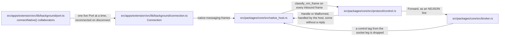
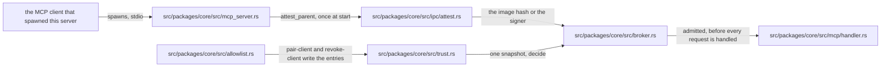
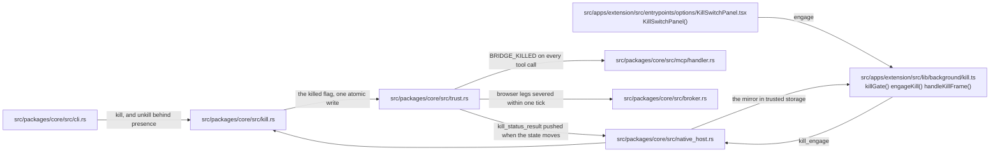
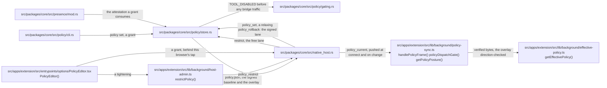
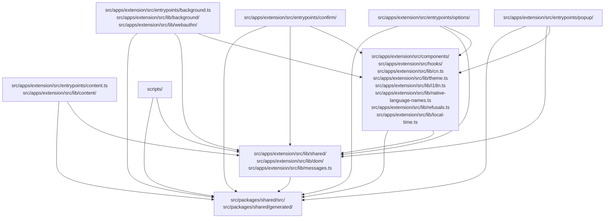

# 架構: chromium-bridge

> 本頁描述 chromium-bridge 的元件結構、資料流、協定、安全模型與限制, 每個信任邊界各配一張圖。安全決策背後的「為什麼」在 [security/rationale.md](./security/rationale.md)。

> 圖中每個標出檔案的方塊所指的檔案都存在, 對 TypeScript 而言還包括它匯出的符號; 說明方塊則標示外部參與者。`moon run check-architecture` 只證明檔案存在, 而每張圖的 `Demonstrated by:` 連結 (下文的「驗證測試:」行) 都指向涵蓋該圖的測試。

## 1. 架構總覽

```
MCP client A --stdio--> +--------------------------------------------------+
MCP client B --stdio--> | chromium-bridge (MCP server instances)           |
                        |                                                  |
                        |  first instance = BROKER                         |
                        |   - owns the bridge socket + lock file           |
                        |   - admits each harness against the              |
                        |     trusted-client allowlist (attested)          |
                        |   - holds session state, dispatches tools        |
                        |  later instances = relays, attach as clients     |
                        +------------------------+-------------------------+
                                                 | bridge socket: NDJSON over a
                                                 | 0600 Unix-domain socket in a
                                                 | 0700 runtime dir (a user-only
                                                 | named pipe on Windows); same-user
                                                 | check + attestation + HMAC handshake
                                                 v
                        +--------------------------------------------------+
                        | chromium-bridge --native-host  (one per browser, |
                        | spawned by that browser, label e.g. "chrome")    |
                        +------------------------+-------------------------+
                                                 | stdin/stdout, Chrome native
                                                 | messaging (4B LE len + JSON)
                                                 v
                        +--------------------------------------------------+
                        | Chromium Bridge extension (MV3, WXT)             |
                        |  service worker: dispatch, allowlist, masking,   |
                        |    kill-switch mirror, enrollment pin            |
                        |  content script + CDP backend: one shared DOM    |
                        |    implementation (snapshot/click/fill/...)      |
                        |  confirm.html: extension-owned confirmation      |
                        |    window, off the page-reachable DOM            |
                        +------------------------+-------------------------+
                                                 |
                                                 v
                                       the user's real page (logged in)

  Management surface (over the core, never a trust root):
    - the CLI: doctor --fix / uninstall / pair / pair-client / kill / unkill / policy / audit
```

## 2. 程序

| 程序 | 由誰啟動 | 職責 | 生命週期 |
|------|---------|------|---------|
| MCP 伺服器 (中介, 即 broker) | 第一個啟動它的 MCP 用戶端 | 持有 socket 與鎖定檔, 准入用戶端程式 (harness), 保存工作階段狀態, 分派工具 | 直到最後一個接入的用戶端程式離開 |
| MCP 伺服器 (中繼) | 之後的每個 MCP 用戶端 | 向中介證明自身身分, 並轉送其用戶端程式的呼叫 | 隨其用戶端的工作階段 |
| 原生訊息主機 | 每個瀏覽器 (透過主機資訊清單) | stdin/stdout 的 NM 訊框與 socket NDJSON 之間的薄橋接; 自行回應控制訊框 (登記、緊急開關 (kill switch)、用戶端管理、註冊修復、策略收緊) | 隨瀏覽器擴充功能的 Port |
| 擴充功能 (SW + 內容指令碼) | 瀏覽器 | 頁面操作、允許清單、確認、遮罩 | SW 約每 5 分鐘重啟一次; 擴充功能隨瀏覽器 |

為什麼伺服器與主機是分開的程序: 瀏覽器自行 (透過資訊清單) 啟動原生訊息主機, MCP 用戶端自行啟動 MCP 伺服器。兩者不是父子程序, 無法共用 stdin/stdout, 因此需要一條 IPC 通道。

為什麼原生訊息主機這麼薄: 所有邏輯都在 MCP 伺服器裡, 所以 SW 重啟或主機重啟都不會丟失工作階段狀態。主機是一個協定轉譯器, 只多做一件事: 它終結控制平面 (登記儀式訊框、緊急開關訊框、用戶端管理訊框、稽核事件轉送), 因此即使橋接斷線或已被緊急開關關閉, 這些功能仍然可用。

為什麼用中介而不是每個用戶端一個伺服器: 可能同時設定了多個 MCP 用戶端, 而舊的「最新者勝出」接管方式 (對前一個伺服器送 SIGTERM) 讓它們爭搶瀏覽器。現在第一個執行個體持有 socket; 之後通過證明的執行個體以中繼身分接入, 共用同一個工作階段, 並以參考計數管理, 最後一個用戶端程式離開時中介就結束。

## 3. 協定層

### 3.1 Native Messaging (擴充功能 <-> 原生訊息主機)

Chrome 的官方協定, 定義於 [developer.chrome.com/native-messaging](https://developer.chrome.com/docs/extensions/develop/concepts/native-messaging)。

- 訊框格式: `4-byte little-endian u32 length` + `UTF-8 JSON`
- 長度只計 JSON 位元組, 不含 4 位元組前綴
- 出站 (主機 -> Chrome) 硬上限: 1 MB (超過會讓 Chrome 立即關閉 Port)
- 入站 (Chrome -> 主機): 64 MB
- 關閉訊號: stdin EOF (不是 SIGTERM); 主機在 EOF 時正常結束
- stderr: 不會顯示給使用者, 但可用來記錄日誌 (會記錄在 Chrome 的內部日誌中)
- argv: Chrome 會附加呼叫方的來源 (origin), 例如 `chrome-extension://<id>/`

主要陷阱 (實作中都已處理):
- 所有 stdout 寫入必須單執行緒進行, 且每個訊框 flush 一次 (並行寫入會在管道緩衝區中交錯, 損毀訊框)
- panic 預設會印到 stdout 而污染串流, 所以 stderr panic hook 是必要的
- `panic = "abort"` (Cargo profile) + stderr hook, 作為雙重保險

### 3.2 MCP JSON-RPC (MCP 伺服器 <-> MCP 用戶端)

基於 NDJSON 上的 JSON-RPC 2.0, 定義於 [modelcontextprotocol.io](https://modelcontextprotocol.io/specification/2026-07-28)。

- 傳輸: stdin/stdout, NDJSON (每行一則訊息, 以 LF 結尾)
- 協定版本 `2026-07-28`, 即無狀態修訂版
- 這一層建構在官方 Rust SDK ([rmcp](https://github.com/modelcontextprotocol/rust-sdk); 信任面的決策在 [security/rationale.md](./security/rationale.md#mcp-伺服器行為)) 之上, 搭配一個侷限於 MCP 服務路徑的小型共用 tokio 執行階段。
- 我們的不變量包在 SDK 外層: 用戶端程式的證明與准入在開始服務前完成, 緊急開關與稽核日誌在每次工具呼叫時執行, 診斷資訊只走 stderr (stdout 是協定), 中介/中繼兩段維持不變
- 沒有交握, 也沒有工作階段狀態: 現代請求在 `params._meta` 中攜帶版本與用戶端能力 (`io.modelcontextprotocol/protocolVersion` 與 `.../clientCapabilities`; rmcp 要求兩者都在, 空的能力物件即可), 並逐請求把關

| 請求 | 回應 |
|------|------|
| 不支援的版本字串 | JSON-RPC 錯誤 `-32022` (`UnsupportedProtocolVersionError`), 帶 `data.supported` (rmcp 的完整集合) 與 `data.requested` |
| 中繼資料不完整或格式錯誤 | `-32602`, 指明欄位 |
| 連線的第一個請求既不是舊式 `initialize` 也不是格式正確的無狀態請求 | 連線直接中斷, 不回覆, 失敗即關閉 |
| 單獨的 `ping` | 直接回答, 不開啟連線 |

- `server/discover` 取代了交握。其結果宣告 `supportedVersions` (rmcp 的完整支援集合, 最新版由單元測試固定為 `2026-07-28`) 與 `capabilities: {"tools": {}}`。
- 可快取的結果 (`server/discover`、`tools/list`) 對 >= 2026-07-28 的對端帶有 `ttlMs: 3600000` / `cacheScope: "private"`: 目錄對每個執行檔而言是靜態的, 所以一小時能限制升級期間的過期程度, 而「private」是保守的範圍, 因為本機單一使用者的伺服器沒有共享快取可供餵入。
- 沒有裸探測形式: 缺少 `_meta` 的 `server/discover` 會被拒絕 (若作為開場請求則直接斷線); 原先規劃的寬鬆處理已刪除, 以與 SDK 一致
- 結果帶有 `resultType`; serverInfo 的 `_meta` 只隨 `server/discover` 的結果傳回; 工具錯誤仍在結果內用 `isError: true` 表示, 而非 JSON-RPC 錯誤, 這樣模型能看到錯誤文字並據以反應
- 處理的方法: `server/discover`、`tools/list`、`tools/call`, 加上給舊式對端的 `ping` (在開啟前與以 initialize 開啟的工作階段中回答 `{}`; 在無狀態開場之後則拒絕); 未知方法回傳 `-32601` (`initialize` 在每個時代都作為舊式協商提供 - rmcp 會回應受支援的所請求修訂版, 對未知的修訂版則以最新版回答)
- **暫時的舊式時代**: 在以 `initialize` 開啟的連線上, 沒有 `_meta` 版本鍵的請求會透過 rmcp 內建的早期修訂版支援, 以前一修訂版的行為提供服務 (`initialize` / `notifications/initialized` / `ping` 以及舊式形狀的工具結果), 直到 Claude Code 的 2026-07-28 支援推廣完成。一旦用戶端程式互通冒煙測試顯示我們的用戶端程式以 `server/discover` 開場, 舊式支援就會停用, 缺少版本鍵則失敗即關閉
- 在服務任何工具呼叫之前, 啟動此伺服器的用戶端程式必須通過受信任用戶端允許清單的准入檢查 (第 6 節與 [trust-boundaries.md](./security/trust-boundaries.md))

### 3.3 內部橋接協定 (中介 <-> 原生訊息主機與中繼)

自訂協定, 走橋接 socket 上的 NDJSON: 在 macOS/Linux 上是 0700 每使用者執行階段目錄內的 0600 Unix domain socket, 在 Windows 上是只有目前使用者能開啟的具名管道 (見 [SECURITY.md](../../.github/SECURITY.md#platform-support))。

連線建立依序進行, 每一步都失敗即關閉:

1. **核心檢查** (Unix): 接受端驗證對端的 UID 等於自己的 UID, 並取得對端執行中執行檔的由核心證明的身分, 該身分必須與自己的映像相符 (雙向)。
2. **HMAC 交握**: 伺服器送出一個新的 nonce; 對端以鎖定檔中的每次執行祕密計算 `HMAC-SHA256(secret, nonce || 0x00 || label)` 回應, 標籤只在對端宣告自己是瀏覽器時才帶上。祕密從不經過線路; nonce 擊敗重放, 而未被 MAC 涵蓋的標籤無法通過驗證。
3. **接入訊框**: 一個必要的、宣告角色的訊框。瀏覽器的原生訊息主機以瀏覽器身分接入, 標籤取自其交握回應所攜帶的那個 (`chrome`、`brave`...); 中繼以其經證明的用戶端程式身分接入, 中介會對照受信任用戶端允許清單檢查該身分。

```mermaid
flowchart LR
  peer["a connecting peer: a browser's native host, or a relay"]
  lock["src/packages/core/src/ipc/lockfile.rs"]
  socket["src/packages/core/src/ipc/socket.rs"]
  cred["src/packages/core/src/ipc/peercred.rs"]
  attest["src/packages/core/src/ipc/attest.rs"]
  hs["src/packages/core/src/ipc/handshake.rs"]
  broker["src/packages/core/src/broker.rs"]
  session["src/packages/core/src/session.rs"]
  lock -->|endpoint and per-run secret| peer
  peer -->|connect| socket
  socket -->|same user| cred
  cred -->|same executable image, both ways| attest
  attest -->|HMAC over a fresh nonce and the claimed browser label| hs
  hs -->|attach frame| broker
  broker -->|a browser attach, registered under its label| session
```



鎖定檔中的祕密從不經過線路, 且每個連線的 nonce 都是新的, 所以截獲的回覆無法重放。中繼的接入訊框攜帶它自己的 `attest_parent` 所量測的身分; 中介信任這個量測, 因為中繼先通過了 `attest_peer`, 因此就是這個執行檔。中繼從不進入工作階段: 中介保留自己的准入守衛, 並親自對著共用工作階段為中繼的用戶端程式提供服務。

驗證測試: [session/tests.rs](../../src/packages/core/src/session/tests.rs), [broker/tests.rs](../../src/packages/core/src/broker/tests.rs), [handshake_verify.rs](../../src/packages/core/fuzz/fuzz_targets/handshake_verify.rs), [adversarial.py](../../tests/protocol/adversarial.py)。

接入之後, 工具流量就是 `BridgeReq`/`BridgeResp` 這對信封 (`src/packages/core/src/protocol.rs`; Rust 型別即線路契約, 見第 11 節):

```typescript
interface BridgeReq {
  id: number;        // monotonically increasing, pairs responses
  op: string;        // operation name, e.g. "tab_list", "page_click"
  browser?: string;  // target browser label (required when several attached)
  args: unknown;     // operation arguments
}

interface BridgeResp {
  id: number;
  ok: boolean;
  data?: unknown;
  error?: string;
}
```

控制訊框 (登記、撤銷、緊急開關、稽核事件、策略、語言、WebAuthn) 走擴充功能與其主機之間的原生訊息那一段, 並在主機終結; 同類訊框若從 socket 那一段抵達, 會被當成注入丟棄 (見 [trust-boundaries.md](./security/trust-boundaries.md))。

### 3.4 原生訊息主機的訊框路由



路由器是訊框的純函式, 所以「處理還是轉送」的決定不需要 socket 就能單元測試。橋接請求帶 `op` 而沒有 `type`, 而 socket 交握訊框從不經過泵送迴圈, 所以任何合法訊框都不會與控制標籤衝突。

驗證測試: [control/tests.rs](../../src/packages/core/src/protocol/control/tests.rs), [native_host/tests.rs](../../src/packages/core/src/native_host/tests.rs), [port-routing.test.ts](../../src/apps/extension/tests/background/port-routing.test.ts), [cancel_test.ts](../../tests/browser/cancel_test.ts)。

## 4. 元件詳解

### 4.1 Rust 核心 (`src/packages/core`) 與執行檔 (`src/apps/host`)

執行檔是 `chromium-bridge-core` 函式庫之上的一層薄薄的 argv 分派 (`src/apps/host/src/main.rs`):

| 模組 | 職責 |
|------|------|
| `protocol.rs` | 三種協定的訊息型別與讀寫; 線路信封契約; stderr panic hook; 忽略 SIGPIPE |
| `protocol/control.rs` | 主機處理的控制訊框 (enclave、管理、緊急開關、稽核、瀏覽器註冊狀態與修復、策略及其收緊通道、語言、WebAuthn), 以及 `classify_nm_frame`, 即在本機回答這些訊框並轉送其餘一切的路由器 |
| `ipc/` | 橋接 socket: 平台 socket + 鎖定檔 + 對端憑證 + 證明 + HMAC 交握, 按關注點拆分並附平台實作 |
| `broker.rs` | 中介所有權、中繼接入/離開的參考計數、DoS 上限、緊急開關監看器 |
| `session.rs` | 以瀏覽器標籤為鍵的連線登錄表; 以 id 配對請求與回應; 每連線的世代守衛; 一個進行中守衛, 在工具呼叫的期限到時取消被放棄的請求 |
| `mcp_server.rs` | 預設模式: 用戶端程式准入、JSON-RPC 迴圈、分派進共用工作階段 |
| `native_host.rs` | `--native-host` 模式: NM 訊框 <-> socket NDJSON、控制平面訊框處理、EOF 時正常結束 |
| `tools/` | 工具目錄 (26 個工具; 跨程序契約的來源): 每個工具一列 `catalogue!`, 產生 `BridgeCommand` 列舉、`ToolId` 索引與 `Tool` 記錄 (中繼資料、授予、分派、具型別的參數 schema); 能力從記錄中讀出 |
| `runtime_record.rs` | 執行階段目錄中每個 JSON 記錄的唯一載入器與寫入器: 有上限的讀取、版本信封、嚴格解析、在執行階段鎖之下的原子 0600 寫入 |
| `migrations/` | 每個記錄一座遷移階梯, 一個地板加上若干階 (規則見下方執行階段狀態表之後); 階梯是相容性程式碼唯一的家 |
| `allowlist.rs` | 受信任用戶端允許清單: 項目型別、配對與撤銷寫入, 以及 `pair-client` / `revoke-client` / `list-clients` |
| `trust.rs` | 信任記錄 (`trust.json`): 緊急開關閂鎖、已配對的用戶端、變更紀元, 以及每個強制執行點從一次讀取得出的准入決定 |
| `kill.rs` | 緊急開關的啟用/解除; 解除需要 `PresenceAttestation` |
| `presence/` | 授予能力之行為的使用者在場證明: 來自該行為規則所允許憑證的 WebAuthn 斷言 (解除緊急開關或授予用本瀏覽器的憑證, 登記另一個瀏覽器可用任何已登記的憑證), 僅在該規則不允許任何憑證時才用擴充功能的確認視窗, 或在 CLI 終端機上輸入的片語; 每次行為由哪條路徑背書都會記入稽核 |
| `webauthn/` | 作為 WebAuthn 信賴方 (relying party) 的主機: 輕觸所簽署的聲明、註冊與斷言解析器、驗證器, 以及保存在 `trust.json` 中的登記儲存 |
| `enclave/` | 主機身分金鑰: `pair` 鑄造進 OS 憑證儲存區 (或以 `--file-store` 存成 0600 檔案) 的 P-256 金鑰, 擴充功能固定它並用它驗證簽章的策略基準 |
| `audit.rs` | 持久的稽核日誌: 有上限的 0600 `audit.log`、嚴格解析的 JSON 記錄、`audit` 子命令讀取器 |
| `registration.rs` + `browsers.rs` | `doctor --fix` 與 `uninstall` 背後的註冊引擎與瀏覽器路徑解析器 |
| `doctor.rs` | 唯讀健康報告 (`doctor` / `status` / `doctor --list`) |
| `error.rs` | 工具呼叫邊界上具型別的 `CallError`, 以及穩定的 `ERROR_SPECS` 錯誤分類 |
| `log.rs` | 分級的 stderr 日誌器 (`BB_LOG`) 與 `log_*!` 巨集 |
| `identity.rs` | 原生訊息主機 id 與固定的擴充功能金鑰: 唯一的定義處 |

### 4.2 擴充功能 (`src/apps/extension`)

以 WXT 建構 (它產生資訊清單, 包含固定的金鑰), 搭配 React UI、TypeScript strict、Vitest + `fakeBrowser` 測試。載入未封裝擴充功能的目標是建置輸出 `build/extension/chrome-mv3`, 不是原始碼目錄。

| 位置 | 職責 |
|------|------|
| `src/apps/extension/src/entrypoints/background.ts` | Service Worker 進入點: 原生 port + 重新連線、訊息路由器 |
| `src/apps/extension/src/entrypoints/content.ts` | 內容指令碼進入點: 注入守衛、把 op 分派進共用的 DOM 層 |
| `src/apps/extension/src/entrypoints/confirm/` | 確認視窗: 一份擴充功能擁有的 `chrome-extension://` 文件, 頁面無法讀取、覆蓋或點擊 |
| `src/apps/extension/src/entrypoints/options/`, `src/apps/extension/src/entrypoints/popup/` | 設定 (Zod 驗證、有版本、可遷移)、主機管理面板, 以及授權/狀態彈出視窗 |
| `src/apps/extension/src/lib/background/` | 分派、允許清單儲存、分頁/CDP 後端、cookie、出站遮罩、緊急開關鏡像、登記、策略同步, 以及 `exchange.ts`: 唯一的單飛主機往返 (認領、期限、事後復原、回覆路由、卸離即失敗), 用戶端管理、緊急開關、主機管理與 WebAuthn 交換都搭載其上 |
| `src/apps/extension/src/lib/webauthn/` | 在場交換的背景那一半: 與主機的訊框交換 (儀式本身位於 `lib/shared/` 之下) |
| `src/apps/extension/src/lib/dom/` | 唯一的共用 DOM 實作 (快照/參照/動作); CDP 後端隨附其字串化的原始碼, 所以兩個頁面後端不可能分歧 |
| `src/apps/extension/src/lib/shared/` | 設定 schema、訊息協定型別、允許清單比對, 以及在場交換的頁面那一半: `webauthn-ceremony.ts` 中對瀏覽器認證器進行的 WebAuthn 儀式 |
| `src/apps/extension/src/locales/` | i18n 語言包, 每個語系一個 `*.yml` (en、zh_CN、zh_TW); CI 強制鍵的一致 |

信任狀態隔離: 登記固定值、緊急開關鏡像、允許清單與稽核環都放在只限擴充功能情境存取的儲存空間 (`setAccessLevel(TRUSTED_CONTEXTS)`), 訊息路由器拒絕任何非擴充功能自身頁面送來的安全相關訊息。

### 4.3 磁碟上的產物

註冊 (由 `doctor --fix` 透過 `registration.rs` 寫入):

```
macOS   ~/.chromium-bridge/run-host-<browser>.sh      # wrapper: exec <host> --native-host --label <browser>
        ~/.chromium-bridge/run-host.sh                # unlabeled, for a manifest several browsers read
        ~/Library/Application Support/<Vendor>/NativeMessagingHosts/
          com.vivswan.chromium_bridge.host.json       # manifest -> that browser's wrapper

Linux   ${XDG_DATA_HOME:-~/.local/share}/chromium-bridge/run-host-<browser>.sh
        ${XDG_CONFIG_HOME:-~/.config}/<vendor>/NativeMessagingHosts/
          com.vivswan.chromium_bridge.host.json

Windows %LOCALAPPDATA%\chromium-bridge\com.vivswan.chromium_bridge.host.json
        HKCU\Software\<Vendor>\NativeMessagingHosts\com.vivswan.chromium_bridge.host
          (Default) = absolute path of the manifest; manifest points at the exe
```

資訊清單的 `path` 就地指向進行註冊的執行檔 (在 Unix 上經由包裝指令碼, 因為資訊清單格式沒有 `args` 欄位); 不建置、不下載、不複製任何東西。包裝指令碼只在只有一個瀏覽器會啟動該資訊清單時帶上 `--label <browser>`; 多個瀏覽器共讀的資訊清單得到不帶標籤的 `run-host.sh`, 以 `registration.rs` 為準。在 Windows 上, Chrome 會把擴充功能來源附加到命令列, 藉此選擇原生主機模式。

執行階段狀態, 位於 0700 的每使用者執行階段目錄 (macOS: `$XDG_RUNTIME_DIR/chromium-bridge` 或 `~/Library/Application Support/chromium-bridge`; Linux: `$XDG_RUNTIME_DIR/chromium-bridge`, 退而求其次用 XDG 快取目錄; Windows: `%LOCALAPPDATA%\chromium-bridge`):

| 檔案 | 內容 |
|------|----------|
| `run.lock` (0600) | 中介的 pid 與每次執行的 HMAC 祕密; socket 的會合點 |
| 橋接 socket (0600) | 僅限 Unix; 不存在任何監聽連接埠 |
| `trust.json` (0600) | 信任記錄: 緊急開關閂鎖、受信任用戶端允許清單、WebAuthn 登記, 以及變更紀元 |
| `policy.json` (0600) | 主機持有的策略: 簽章的基準與未簽章的限制覆蓋層 (第 11.3 節) |
| `policy-history.json` (0600) | 被取代的策略修訂版, 一個有界的環; 回滾用的資料, 從不是權威 |
| `lang.json` (0600) | 共用的 `uiLanguage` 偏好及其回音抑制序號 |
| `audit.log` (0600) | 持久的稽核日誌, 有大小上限 |
| `host_key.json` (0600) | 主機身分金鑰的純量, 僅在使用者執行過 `pair --file-store` 時存在; 否則金鑰放在 OS 憑證儲存區 |

每個透過 `runtime_record.rs` 載入的記錄 (`trust.json`、`policy.json`、`policy-history.json`、`lang.json` 與 `host_key.json`) 都帶有 `version` 信封, 並沿著 `src/packages/core/src/migrations/` 中的遷移階梯往上爬。擴充功能的設定儲存也沿著形狀相同的一座階梯爬, 位於 `src/apps/extension/src/lib/shared/settings-migration.ts`。一座階梯是一個明確的地板加上一組階, 目前版本由兩者推導:

```text
FIRST_VERSION = 0                        the version the first rung lifts from
MIGRATIONS    = [rungA, rungB]           the array is the ladder; no rung carries a version, no file name does
CURRENT       = FIRST_VERSION + MIGRATIONS.length

append a rung                           -> CURRENT rises by one
retire rung 0, raise FIRST_VERSION      -> CURRENT unchanged; every stored version keeps its meaning
stored < FIRST_VERSION                  -> too old to climb: a host record is refused, the settings
                                           store is stamped current and salvaged per field
```

地板是讓淘汰最舊一階變得安全的關鍵。若只由階數推導, 第一階被刪除的那一刻, 每個已儲存的版本都會悄悄重新編號, 錯誤的那一階就會在每個現有檔案上執行。今天每座階梯要麼是空的, 要麼只有一個無操作的階: 這是形狀, 不是資料。

主機身分金鑰存放在 OS 憑證儲存區 (Keychain、Credential Manager 或 Secret Service) 中, 作為 `com.vivswan.chromium-bridge.enclave.signing.v1` 項目, 並以執行階段目錄加以限定, 因此兩個目錄永遠不會共用同一把; `pair --file-store` 則改放進 `host_key.json`。

## 5. 關鍵資料流

### 5.1 一次完整的工具呼叫往返 (`page_click(ref="e3")`)

```
1. MCP client -> MCP server (stdin NDJSON):
   {"jsonrpc":"2.0","id":2,"method":"tools/call",
    "params":{"name":"page_click","arguments":{"ref":"e3"},
     "_meta":{"io.modelcontextprotocol/protocolVersion":"2026-07-28",
      "io.modelcontextprotocol/clientCapabilities":{}}}}

2. dispatch checks: harness admitted, epoch fresh, kill switch clear
   -> session.call assigns BridgeReq.id=1, writes to the socket
   (a relay's call reaches the same dispatcher through the broker)

3. native host reads socket NDJSON -> NM frame -> stdout

4. extension SW receives {op:"page_click",args:{ref:"e3"}}
   -> resolve target tab
   -> ensureAllowed(tab.url)   // allowlist; prompts if not authorized
   -> inject content script if needed
   -> content: resolveTarget({ref:"e3"}) -> element
   -> high-risk? (submit/link) -> confirmation window (confirm.html);
      deny/timeout/close all reject
   -> click

5. The result returns along the same path, masked at the SW egress,
   and session pairs it back to the pending call by id.
```

### 5.2 原生訊息主機重新連線

```
Browser closes the Port -> host gets stdin EOF -> host exits
Extension onDisconnect -> scheduleReconnect(2s)
connectNative() -> browser re-spawns the host -> host reads the lock file
  -> connects to the socket -> kernel checks + HMAC + attach(label)
Broker accepts -> session re-attaches that label (generation-guarded:
  the superseded connection is severed, so a host still alive on it exits
  and its worker life redials; pending calls of the old connection drain
  as Disconnected)
```

同標籤的接入總是獲勝, 並關閉它所取代的連線。當一個瀏覽器同時保有擴充功能的兩個 worker 執行個體時, 兩者大約每 2 秒輪流占據該槽位, 每一次重撥都關閉另一方, 直到其中一個執行個體結束。

### 5.3 第二個 MCP 用戶端接入

```
Client B spawns its own chromium-bridge process
  -> it finds a live broker via the lock file
  -> attests itself over the socket (kernel checks + HMAC + attach frame
     carrying its harness's attested identity)
  -> broker checks the identity against the trust record's paired clients; unmatched fails closed
  -> B's tool calls multiplex through the shared session
Broker exits when the last attached harness detaches.
```

## 6. 安全模型

完整的論述在 [docs/security.md](./security.md); 這裡是地圖。

| 邊界 | 機制 | 依據 |
|------|------|-----|
| 用戶端程式准入 (stdio) | 由核心證明的父程序身分, 對照受信任用戶端允許清單檢查; 一旦登記後即失敗即關閉 | [用戶端程式准入](./security/rationale.md#用戶端程式准入與用戶端允許清單) |
| 橋接 socket | 0700 目錄中的 0600 Unix domain socket; 對端 UID 檢查; 雙向執行檔證明; HMAC 挑戰-回應; 宣告角色的接入 | [主機身分](./security/rationale.md#主機身分與證明) |
| 任一方撤銷 | 主機端的每個強制執行點在決定前都重新讀取 `trust.json` (擴充功能的緊急開關閘門讀取其鏡像); 解除配對時刪除憑證的兩半 | [撤銷](./security/rationale.md#撤銷與緊急開關) |
| 主機身分 (主機 <-> 擴充功能) | 由 `pair` 鑄造的 P-256 主機金鑰, 擴充功能在比對指紋後將其固定; 每個簽章的策略基準都對照固定的金鑰驗證 | [登記](./security/rationale.md#登記與使用者在場) |
| 使用者在場 (主機 <-> 擴充功能) | 授予能力的行為需要 WebAuthn 斷言: 解除緊急開關, 用在本瀏覽器下登記的憑證; 登記另一個瀏覽器, 用本機上任何已登記的憑證。只有在該規則不允許任何憑證時, 確認視窗才頂替上場, 所以已登記的瀏覽器永遠不會被降級 | [使用者在場](./security/rationale.md#登記與使用者在場) |
| 網站允許清單 | 逐來源核准 + `chrome.permissions.request`; 頁面無法自行核准 | [信任邊界](./security/trust-boundaries.md) |
| 高風險確認 | 擴充功能擁有的視窗, 不在頁面可觸及的 DOM 中; 逾時/關閉即拒絕 | [信任邊界](./security/trust-boundaries.md) |
| 皇冠寶石確認 | `page_eval` / `page_upload` 每次呼叫都在擴充功能擁有的視窗中確認; 只有 `page_eval` 的提示可以豁免, 由主機策略的 `confirmPageEval` 選擇退出 (在已固定的擴充功能上為簽章策略); 沒有為它們建置 WebAuthn 路徑 | [工具風險矩陣](./security/tool-risk-matrix.md) |
| 緊急開關 + 稽核 | 在四層強制執行的失敗即關閉閂鎖; 解除需在場; 先決定後記錄的日誌 | [緊急開關](./security/rationale.md#撤銷與緊急開關) |
| 遮罩 | Cookie/儲存空間/eval/頁面文字的出站資料在 SW 中遮罩, 兩個頁面後端共用一次 | [工具風險矩陣](./security/tool-risk-matrix.md) |
| 協定安全 | NM 1 MB 出站上限; 單一寫入者 + flush; stderr panic hook; 經模糊測試的解析器 | (第 3.1 節) |

### 6.1 用戶端程式准入



授權以經證明的錨點為鍵, 從不以自我宣稱的用戶端名稱為鍵, 後者只是日誌標籤。在受信任用戶端允許清單存在之前, 每個用戶端程式都會被准入, 並以 ERROR 等級記錄這種開放姿態; 一旦清單存在, 不相符的用戶端程式會在任何工具呼叫之前被拒絕。

驗證測試: [broker/tests.rs](../../src/packages/core/src/broker/tests.rs), [adversarial.py](../../tests/protocol/adversarial.py)。

### 6.2 基於 WebAuthn 的使用者在場

```mermaid
flowchart LR
  host["src/packages/core/src/native_host.rs"]
  exchange["src/apps/extension/src/lib/webauthn/exchange.ts<br>handleWebAuthnFrame() pendingPresenceRequest() assertPresence()"]
  page["the options page, the RP page the user taps on"]
  ceremony["src/apps/extension/src/lib/shared/webauthn-ceremony.ts<br>requestOptions() assert() browserClient"]
  authenticator["the browser's WebAuthn client and the platform authenticator"]
  verify["src/packages/core/src/webauthn/verify.rs"]
  store["src/packages/core/src/webauthn/store.rs"]
  trust["src/packages/core/src/trust.rs"]
  host -->|presence_request, pushed for a granting act| exchange
  exchange -->|holds the request and opens the page| page
  page -->|the challenge and the allowed credentials| ceremony
  ceremony -->|navigator.credentials.get| authenticator
  authenticator -->|the assertion| ceremony
  ceremony -->|the assertion fields| page
  page -->|the answer| exchange
  exchange -->|presence_assert| host
  host -->|verify against the enrolled key| verify
  verify -->|sign counter advanced| store
  store -->|enrollments| trust
```



主機是信賴方, 擴充功能是 WebAuthn 用戶端, 以擴充功能 id 作為 RP ID。登記以 `enroll_begin`、`enroll_options`、`enroll_finish` 與 `enroll_result` 走同一套交換; 一台機器上的第一次登記採首次使用即信任, 之後每一次都需要本機上任一瀏覽器下已登記憑證的輕觸。

選項頁面執行儀式並作答: 它登記這個瀏覽器的認證器, 解除緊急開關, 並簽署第 11.3 節的各項授予 (一次策略 set、一次放寬的回復、一次用戶端配對)。一次解除或一次授予是在這個瀏覽器已登記憑證上的一次觸碰; 當主機的請求沒有指名任何憑證時, 頁面改為請求一次確認。

它的「忘記這個瀏覽器」動作送出 `browser_revoke`, 主機隨即忘記在該連線自身標籤下登記的憑證, 與 `chromium-bridge revoke <browser>` 是同一個動作。

來自確認視窗的 `presence_confirm` 只在沒有任何已登記憑證能夠作答時才被接受, 所以已登記的瀏覽器永遠不會被降級為一次點擊。

交換對每一次拒絕的回答, 無論在 `presence_result` 還是 `enroll_result` 上, 都帶有一個來自 `src/packages/core/src/webauthn/refusal.rs` 中 `RefusalCode` 名冊的代碼, 它是在場拒絕原因的唯一清單。`moon run gen` 把它輸出為 `refusals.ts`, 而 `src/apps/extension/src/lib/refusals.ts` 以它為鍵為每個代碼配一句話, 所以主機新增的代碼在那裡是型別錯誤, 直到它的句子落地。

驗證測試: [webauthn/tests.rs](../../src/packages/core/src/webauthn/tests.rs), [exchange.test.ts](../../src/apps/extension/tests/webauthn/exchange.test.ts), [ceremony.test.ts](../../src/apps/extension/tests/webauthn/ceremony.test.ts), [webauthn_test.ts](../../tests/browser/webauthn_test.ts)。

### 6.3 緊急開關



沒有任何東西會自行清除閂鎖: 不會因逾時、重啟或重新連線而清除。解除方式是在終端機執行 `chromium-bridge unkill`, 或擴充功能的 `kill_release`, 後者由該瀏覽器下已登記憑證的 WebAuthn 輕觸作答, 或在該瀏覽器未登記任何憑證時由確認視窗作答。損毀的記錄會拒絕兩個方向, 因為從未知狀態解除緊急開關就是失敗即開放。

驗證測試: [kill.test.ts](../../src/apps/extension/tests/background/kill.test.ts), [deny-kill.test.ts](../../src/apps/extension/tests/background/confirm/deny-kill.test.ts), [broker/tests.rs](../../src/packages/core/src/broker/tests.rs), [native_host/tests.rs](../../src/packages/core/src/native_host/tests.rs)。

## 7. 關鍵限制 (踩過並處理的坑)

### 7.1 MV3 Service Worker 每 5 分鐘重啟 (Chromium #40733525)
Chrome 約每 5 分鐘強制重啟 SW 一次, 記憶體中的狀態隨之丟失; Port 關閉, 原生訊息主機在 stdin EOF 時結束。緩解: 持久狀態放在 `chrome.storage` (限於受信任情境) 或 MCP 伺服器程序中; SW 在啟動時重新連線; 參照標記蓋在 DOM 屬性上, 讓內容指令碼在重啟後重建其對應表; 待處理的呼叫受世代守衛保護。

### 7.2 chrome.debugger 會強制顯示橫幅
任何 `chrome.debugger.attach` 在附加期間都會在每個分頁上顯示「Started debugging this browser」橫幅。緩解: 預設快照使用內容指令碼, 從不碰偵錯工具; `page_snapshot_precise` 在同一個處理常式中附加、讀取 a11y 樹、再分離 (在 finally 路徑上分離), 所以橫幅只會閃現約一秒。

### 7.3 Native Messaging 資訊清單沒有 args 欄位
資訊清單的 `path` 必須是純執行檔。緩解: 一個包裝指令碼把 `--native-host` 寫死在裡面, 當只有一個瀏覽器會啟動該資訊清單時帶 `--label <browser>` (`run-host-<browser>.sh`), 多個瀏覽器共讀時則不帶 (`run-host.sh`), 以 `registration.rs` 為準; 標籤是中介連線登錄表的鍵。

### 7.4 chrome.permissions.request 需要使用者手勢
主機權限只能在使用者手勢的情境中請求。緩解: 允許清單的授權流程走彈出視窗; 「允許」一併請求權限並記錄項目。

### 7.5 靜態 content_scripts 與選用權限衝突
初始主機權限為空時, 資訊清單宣告的內容指令碼永遠不會注入。緩解: 資訊清單中不放 `content_scripts`; 一切都在執行階段透過 `chrome.scripting.executeScript` 注入, 跟隨已授予的選用權限。

### 7.6 Rust panic 會污染 stdout
panic 訊息預設輸出到 stdout, 會損毀 NM 訊框與 MCP NDJSON。緩解: release profile 中的 `panic = "abort"` 加上 stderr panic hook, 作為雙重保險。

### 7.7 page_eval 使用 Function 建構函式而非 eval()
`page_eval` 必須在頁面的全域範疇執行程式碼, 但內容指令碼在嚴格模式的閉包中執行, `eval` 看到的是錯誤的範疇。緩解: `new Function('"use strict"; return (async () => { <code> })()')()`, 它在全域範疇執行並支援 `return`/`await`。在 CDP 模式下, 同樣的程式碼改經 `Runtime.evaluate` 在頁面的 MAIN world 中執行。

在單執行緒 JS 中不可能有可靠的執行逾時; 兜底是工具呼叫的 120 秒預算 (`src/packages/core/src/tools/mod.rs` 中的 `CALL_BUDGET`)。工作階段本身沒有回覆逾時; 它只把等待瀏覽器連線的時間上限設為 12 秒 (`src/packages/core/src/session.rs` 中的 `CONNECT_WAIT`)。結果在離開擴充功能前會經過安全序列化 (循環/DOM/特殊型別) 與遮罩。

### 7.8 chrome.debugger 的限制 (page_snapshot_precise、CDP 模式)
`chrome.debugger` API 只能在 SW 中使用, 無法附加到 `chrome://` 或 Web Store 頁面, 且每個分頁只允許一個偵錯工具 (DevTools 也算)。緩解: CDP 工作在 SW 中進行; URL scheme 檢查過濾掉不可偵錯的頁面; 精確快照的參照使用 `p` 前綴, 以避開內容指令碼的參照; 分離放在 finally 路徑上。

### 7.9 Cookie 綁定主機名稱; 儲存空間同源; httpOnly 可讀
`chrome.cookies` 受主機權限約束, 且位於 SW 中 (它能讀取 `httpOnly`, 這是它的核心價值); 頁面的 `localStorage`/`sessionStorage` 只能由同源的內容指令碼讀取。因此 `cookie_get` 在 SW 中, `storage_get` 在內容指令碼中, 兩者皆唯讀且一律遮罩。

## 8. 技術選型

| 面向 | 選擇 | 依據 |
|------|------|------|
| 後端語言 | Rust, 單一執行檔 + 子命令 | 單檔發佈; 主機資訊清單要求絕對路徑; 伺服器、主機與 CLI 共用一套程式碼 |
| IPC | Unix domain socket + 鎖定檔 (Windows 上為僅限使用者的具名管道) | 沒有監聽連接埠; 核心的對端憑證 (Windows 上為管道對端的 pid) 讓證明成為可能 |
| 密碼學與解析 | RustCrypto `hmac`/`sha2`、`subtle`、`serde` | 偏好廣泛採用的函式庫而非自製程式碼; 只在沒有函式庫可用時才自行撰寫 |
| 擴充功能平台 | WXT 上的 MV3、React UI、Vitest | 產生含固定金鑰的資訊清單; 統一的 `browser.*`; 可測試的 SW |
| 契約 | Rust 核心產生 TS 端 | 單一事實來源; CI 在漂移時失敗。見第 11 節 |
| 工程閘門 | moon + proto + GitHub Actions、bun workspace、Biome、cargo-nextest、typos/machete、cargo-deny + 艦隊的 Trivy 與相依套件審查 | 一次 `moon run ci` 執行本機的跨平台閘門; CI 在其上疊加額外工作 (本儲存庫自己的工作放在 `.github/workflows/checks.yml`, 在受管理的 ci.yml 的 all-green 閘門內被呼叫) |
| MCP 版本 | 2026-07-28 (無狀態) | 目前的規範修訂版, 以官方 rmcp SDK 提供: 逐請求的版本把關、`server/discover`; rmcp 內建的舊式時代支援在推廣期間服務較舊的用戶端程式 |

## 9. 已知限制

1. **快照準確度**: 內容指令碼的 a11y 樹是近似值 (shadow DOM、複雜的 ARIA); `page_snapshot_precise` 是權威的後備方案。
2. **跨來源 iframe**: 內容指令碼無法讀取它們。
3. **Windows 以路徑量測映像**: 管道對端的映像是從其檔案路徑雜湊而來, 這是[信任邊界帳冊](./security/trust-boundaries.md#邊界-2-rust-mcp-伺服器---原生訊息主機-橋接-socket-ndjson)所承擔的殘餘風險; 閘門本身 (僅限使用者的管道、雙向證明、HMAC、用戶端程式准入) 在那裡與在 Unix 上同樣成立。見 [SECURITY.md](../../.github/SECURITY.md#platform-support)。
4. **同一使用者的攻擊者執行我們自己的執行檔**: 核心證明區分的是執行檔, 不是意圖; 見[信任邊界](./security/trust-boundaries.md)的殘餘風險。
5. **撤銷傳到擴充功能的延遲**: socket 那一段是即時的; 擴充功能反映主機金鑰撤銷的時間以下一次 Service Worker 喚醒為界。

## 10. 擴充點

- **新增工具**: 核心中一個目錄項目 + 處理常式、`moon run gen`、擴充功能中的一個 op 落腳處、一列風險矩陣, 以及測試; 在每個面向都覆蓋之前, 漂移守衛都會失敗。逐步清單在 [CONTRIBUTING.md](../../CONTRIBUTING.md#adding-a-tool)。
- **新增瀏覽器**: 解析器 (`browsers.rs`) 中一列; doctor、--fix 與 uninstall 從那裡接手。
- **技能層**: 不改架構; 增量加入的技能檔案, 教代理把現有工具組合起來。

## 11. 協定邊界契約: 錯誤分類與交握

跨程序契約位於 Rust 核心, 即單一事實來源; TypeScript 端由它產生到 `src/packages/shared/generated` (建置產物, 從不追蹤), 執行階段行為也對照它驗證。標準模組及其衍生產物:

- **工具目錄** (`src/packages/core/src/tools/catalogue.rs`): 每個工具的名稱、面向模型的英文描述、JSON-Schema `inputSchema`, 以及策略中繼資料 (風險 / 範圍 / 權限 / 確認)。`moon run gen` 執行核心的 `emit_contract` 範例與 `scripts/gen-ops.ts`, 產生 `ops.ts`: op 名稱、策略中繼資料, 以及每個工具的 Zod 參數驗證器。
- `BridgeCommand` 請求聯集從這些驗證器推導而來, 所以編譯期型別與執行階段檢查是同一份產物。每個讀取產生 TS 的任務都會先從 Rust 來源重新建置它, 因此不存在可能偏離的簽入副本。UI 標籤刻意不納入契約; 它們是擴充功能的 UI 文案 (擴充功能 `*.yml` 語言包中的 `tools.<op>` 鍵)。
- **錯誤分類** (`src/packages/core/src/error.rs` 中的 `ERROR_SPECS`): 穩定的跨程序 `code`, 附帶 `category`、`retryable`, 以及面向使用者/模型的 `message`。`CallError::code()` 把 Rust 的工具呼叫錯誤對應到該表的一個子集 (`cargo test` 強制檢查成員資格), 而 `errors.ts` 給 TS 消費者同樣的代碼常數 (目前無人使用; 見第 11.1 節)。
- **能力** (`src/packages/core/src/tools/capabilities.rs`): 目錄之上可協商的分組, 輸出到 `protocol.ts`。`cargo test` 強制每個經橋接路由的工具恰好被一個能力涵蓋, 且每個能力的權限等於其工具權限的聯集。
- **協定版本** (`src/packages/core/src/protocol.rs`): 內部橋接協定的整數 (`BRIDGE_PROTOCOL_VERSION`), 以及伺服器所說的 MCP JSON-RPC 修訂版 (`MCP_PROTOCOL_VERSION`, 逐請求把關、由 `server/discover` 宣告、由協定 e2e 測試套件斷言), 兩者都輸出到 `protocol.ts`。
- **稽核轉送允許清單** (`src/packages/core/src/audit.rs` 中的 `EXTENSION_AUDIT_KINDS`): 主機透過 `audit_event` 控制訊框接受的、由擴充功能擁有的稽核種類 (`extension_kind` 由同一份清單推導), 輸出到 `audit.ts`。擴充功能的轉送集合及其稽核環詞彙中被轉送的前綴都建立在產生的常數上, 所以轉送邊界的兩側不可能分歧。
- **身分** (`src/packages/core/src/identity.rs`): 原生訊息主機 id 與固定的擴充功能資訊清單金鑰, 輸出到 `identity.ts`。擴充功能匯入 `NATIVE_HOST_ID` 用於 `connectNative`, `EXTENSION_MANIFEST_KEY` 用於建置出的資訊清單, 以及由金鑰推導的 `PINNED_EXTENSION_ID` 用於啟動時的自我檢查。註冊引擎直接使用這些常數, 所以不存在會漂移的安裝程式副本。
- **身分閘門**: 產生 TS 時會從金鑰重新推導 id (`scripts/gen-ops.ts` 在不相符時失敗), 而 `scripts/check-extension-id.ts` (`moon run check-extension-id`, 屬於 `moon run ci`) 驗證建置出的資訊清單與唯一定義處規則。
- **拒絕名冊** (`src/packages/core/src/webauthn/refusal.rs` 中的 `RefusalCode`): 輸出到 `refusals.ts`; [第 6.2 節](#62-基於-webauthn-的使用者在場) 擁有它列舉了什麼以及誰使用它這一事實。
- **主機常數** (金鑰標籤、鎖檔名、用戶端名稱與記錄環境變數、稽核預設筆數, 以及瀏覽器鍵, 每一個都是擁有它的 Rust 模組中的常數): 輸出到 `host.ts`, `scripts/check-docs-literals.ts` 以它約束文件, 所以常數重新命名會讓文件閘門失敗, 而不是讓某一頁悄悄出錯。
- **主機金鑰簽章契約** (`src/packages/core/src/enclave/`: `challenge.rs` 定義網域字串與欄位邊界, `pubkey.rs` 與 `mod.rs` 定義金鑰與簽章的位元組長度以及 `enclave_error` 原因碼): 由核心的 `emit_enclave_contract` 範例輸出到 `enclave.ts` (常數加上 `EnclaveReasonCode` 聯集, 擴充功能的登記狀態機對它做窮盡分類) 與 `enclave-fixture.ts`。
- 夾具檔保存黃金向量: Rust 建構的訊息位元組加上確定性的軟體 P256 證明, 由 `src/apps/extension/tests/background/enclave-golden.test.ts` 透過擴充功能的 WebCrypto 驗證器重放, 所以簽章訊息的編碼本身在兩種語言間被固定下來。夾具檔的簽署金鑰是公開的測試資料, 在兩側都被列入主機身分的拒絕清單 (核心中的 `ensure_not_fixture_key`, 擴充功能配對驗證器與已儲存固定值驗證器中的 `ENCLAVE_FIXTURE_KEY_ID`)。
- **策略文件與方向** (`src/packages/core/src/policy/`): 主機持有的 `PolicyDoc`、十五個策略欄位 (四個能力授予、確認策略、`disabledTools`、確認逾時)、它們的預設拒絕值、每個欄位的寬鬆方向表, 以及 `relaxes`/`restricts` 比較, 加上簽章儲存與 `set_signed`/`restrict` 寫入接縫。
- `moon run gen` 輸出 `policy.ts`: 簽章網域常數、帶方向的欄位清單、預設值, 以及針對文件、數值與限制覆蓋層的嚴格 Zod 驗證器。擴充功能自己從輸出的表重新計算每一次方向比較; 它從不相信主機對變更方向的說法。
- 授予由主機金鑰對 `UTF8("chromium-bridge-policy-v1") || 0x00 || doc_bytes` 簽章, 這是與主機金鑰挑戰網域並列的一個以 NUL 分隔的簽章網域, 相對於它為單射, 所以一種儀式的產物不可能被重放成另一種。
- 任何地方都沒有正規化步驟: 主機簽章並儲存精確的文件位元組, 擴充功能先用其固定的金鑰驗證收到的精確位元組, 再對同一份位元組做嚴格解析。第 11.3 節說明承載這一切的訊框。
- **線路信封與控制訊框** (`src/packages/core/src/protocol.rs` 中的 `BridgeReq` / `BridgeResp`; `src/packages/core/src/protocol/control.rs` 中的 `EnclaveControl`、內嵌 `allowlist::ClientEntry` 的 `AdminControl`、`PolicyControl` 與 `WebAuthnControl`): Rust 型別就是契約, `moon run gen` 從它們產生擴充功能的驗證器到 `envelope.ts`。下表列出每一層及其擁有者。

| 層 | 擁有者 | 內容 |
|-------|-------|---------------|
| 忠實基底, 每個信封與主機->擴充功能訊框各一 | `scripts/gen-envelope.ts` (對 Rust 輸入的規則 G1-G7、A1-A3; 寧可中止產生, 也不輸出任何比 Rust 解析器更弱的東西) 與 `scripts/gen-schema.ts` (每個驗證器都是 json-schema-to-zod 從其 schema 寫出的 Zod 原始碼, 每個型別都是 json-schema-to-typescript 對同一 schema 的讀取, 輸出的驗證器在寫入檔案前須符合規則 R1-R4) | 嚴格物件, 必要欄位必填, 不發明預設值 |
| 強制驗證器, 擴充功能實際執行的那個 | `src/packages/shared/src/envelope-asymmetries.ts` | 基底加上恰好表中的那些項目, 每項帶方向與理由; 由一個具型別裁決建構的訊框 (`policy_current`、`enroll_result`、`presence_result`) 在這裡宣告其 ok 分支, 並輸出為其各分支的聯集, 所以混合其分支的訊框會讓讀取器失敗; 請求的 `args` 與 `policy_current` 的 `overlay` 就是從 `ops.ts` 與 `policy.ts` 匯入的 schema |
| 擴充功能->主機訊框的寫入端 schema | `scripts/gen-envelope.ts` | 建構處以 `satisfies` 對照的型別; 強制執行的讀取器是 Rust serde 解析器 |
| 閘門 (`moon run check-envelope`) | `scripts/check-envelope.ts` | 用兩個驗證器證明每個項目的探測, 把入站分類器約束在讀取器計畫內, 拒絕任何讀取器上手寫的精煉 |
| 產生基底的行為測試 | `src/packages/shared/tests/wire-validators.test.ts` | 未知欄位、缺少必要欄位、型別混淆、巢狀多餘欄位 |

### 11.1 錯誤分類 (ERROR_SPECS)

在工具呼叫邊界, Rust 的具型別錯誤 `CallError` 對應到 `ERROR_SPECS` (`src/packages/core/src/error.rs`) 中穩定的 `code`; `cargo test` 驗證這個對應。`code` 供程式化決策使用 (它帶有 `category` 與 `retryable`); 模型與使用者看到的是 `message`。

| 代碼 | 今天由誰指派 |
|------|------|
| `EXECUTION_FAILED` | MCP 伺服器, 針對擴充功能回報的每個自由格式失敗字串 |
| `TOOL_DISABLED` | MCP 伺服器的策略閘門 (第 11.3 節): 分派在任何橋接流量之前, 拒絕能力授予已關閉或被有效策略停用的工具 |
| `NOT_CONNECTED`、`EXTENSION_NOT_READY`、`CONNECTION_LOST`、准入與撤銷的拒絕、`BRIDGE_KILLED` | MCP 伺服器, 在每個程序中共用同一意義 |
| `PROTOCOL_MISMATCH` | 尚無: 等待版本/能力交握接線 (第 11.2 節) |
| `SITE_NOT_ALLOWED`、`USER_DENIED`、`TAB_NOT_FOUND`、... | 尚無: 需要擴充功能以結構化錯誤回報取代自由格式字串 |

MCP 伺服器 (`src/packages/core/src/error.rs` 中的 `CallError::code()`) 是唯一的指派者, 涵蓋該表的一個子集; 產生到 `errors.ts` 的 TS 常數是為未來的消費者準備的。

### 11.2 能力 / 版本交握

在第 3.3 節的驗證之外, 連線建立還帶有能力與版本的面向: 擴充功能端宣告其支援的 `BRIDGE_PROTOCOL_VERSION` 與可用的能力集合 (見 `src/packages/core/src/tools/capabilities.rs`)。預期的行為 (尚未接線, 見下一段): 不相容的版本以 `PROTOCOL_MISMATCH` 快速失敗, 而不是之後在未知 op 上爆炸; 能力未被宣告的工具則一開始就被拒絕。

如實說明現況: 協商在契約模組中已定義但尚未接線, 延後到執行檔與擴充功能可以獨立升級之時; 第一階段, 即受世代守衛保護的重新連線 (第 5.2 節), 已經落地。等它落地時, 宣告的能力集合應由有效策略推導, 主機持有的策略使這成為可能, 但尚未接線。

注意三種不同的「版本」: MCP JSON-RPC 版本 `2026-07-28` (第 3.2 節)、內部橋接協定版本 (一個整數), 以及發行版本 (來自 Cargo)。三者各不相同。

### 11.3 主機持有的策略與語言同步

主機擁有安全策略: 四個能力授予、確認策略、`disabledTools` 與確認逾時。

主機在執行階段目錄下的 `policy.json` 中最多保存一份簽章的基準加上一份未簽章的限制覆蓋層; 該目錄由 `src/packages/core/src/ipc/runtime_dir.rs` 中的 `RuntimeDir` 解析。

狀態透過 `protocol/control.rs` 中的 `PolicyControl` 訊框傳遞 (策略通道 get、restrict、set、rollback 與 history, 以及語言訊框), 每一個的分類與終結方式都與主機金鑰及管理訊框完全相同: 由主機回答, 從不轉送給 MCP 伺服器, 伺服器那一段若試圖注入則被丟棄。



授予所消耗的在場證明, 在編輯器發起時是這個瀏覽器的在場證明 (第 6.2 節的交換), 否則是 CLI 終端機上輸入的片語; 兩種情況下主機金鑰都簽署精確的文件位元組。由誰回答每項行為, 由[安全頁面](security.md#你要確認什麼-以及什麼算在場)負責。

限制接縫拒絕任何會放寬的覆蓋層, 所以對既有基準的收緊從任一介面都自由傳送; 放寬或第一個基準走授予通道。

驗證測試: [store_tests.rs](../../src/packages/core/src/policy/store/store_tests.rs), [presence/tests.rs](../../src/packages/core/src/native_host/presence/tests.rs), [policy-sync.test.ts](../../src/apps/extension/tests/background/policy-sync.test.ts), [policy-swap.test.ts](../../src/apps/extension/tests/background/policy-swap.test.ts), [policy-editor.test.tsx](../../src/apps/extension/tests/components/policy-editor.test.tsx)。

- `policy_get {}` (擴充功能 -> 主機): 按需重新整理。與這一族中每個由擴充功能發起的訊框一樣, 它只在主機已於同一通道推送過訊框的連線上送出 (策略訊框是 `policy_current`, 語言訊框是 `lang_current`)。
- 其背後的「從不先開口」規則: 舊主機會把未知訊框分類為可轉送, 而 MCP 伺服器的嚴格解析會拆掉瀏覽器那一段, 所以面對舊主機時, 新訊框根本不會流動。
- `policy_current { ok, baseline?, sig?, overlay?, error? }` (主機 -> 擴充功能): 策略狀態, 在每次連線與每次觀察到儲存變更時主動推送, 也是 `policy_get` 的回覆。主機只透過一個具型別的中間型別建構它, 所以擴充功能絕不能看到的混合形式根本無法建構:
  - `ok: true` 帶精確的簽章基準位元組 (base64, 讓簽章產物逐位元組地撐過 JSON 這一跳)、選用的簽章與選用的覆蓋層。
  - `ok: false` 帶 `error` (指出儲存缺失、損壞或無法讀取, 或 `policy_get` 格式錯誤), 且絕不帶基準, 所以擴充功能會失敗即關閉, 而不是信任沒人背書的位元組。
- `policy_restrict { overlay }` (擴充功能 -> 主機) 與 `policy_restrict_result { ok, error? }` (主機 -> 擴充功能): 選項頁面的策略編輯器透過未簽章的限制接縫收緊有效策略, 該接縫拒絕任何放寬; 套用的限制之後會跟著一個攜帶已寫入狀態的 `policy_current`, 所以結果只帶裁決。放寬走下面的授予通道。
- `policy_set { overlay }`、`policy_rollback { revision, entry? }` 與 `policy_history {}` (擴充功能 -> 主機), 各自帶一個結果訊框: 授予通道與被取代修訂版的環。一次 set 或一次放寬的回復會開啟一個 `presence_request` (第 6.2 節), 其核准帶著裁決與一個 `policy_current`; 只收緊的回復自由套用。沒有主機金鑰或變更無效時, 在任何請求存在之前就以 CLI 的措辭拒絕。
- `lang_get {}` / `lang_set { value }` (擴充功能 -> 主機) 與 `lang_current { value, seq }` (主機 -> 擴充功能): 共用的 `uiLanguage` 偏好 (同一執行階段目錄中的 `lang.json`), 刻意放在簽章策略文件之外 - 不簽章、不棘輪、無法影響任何安全決策 - 以序號做回音抑制。

強制執行契約刻意不對稱: 授予能力的策略帶有主機金鑰對精確位元組的簽章, 且寫入時消耗了一次在場證明; 只移除能力的策略則以未簽章覆蓋層的形式自由傳遞。同一使用者的程序能對主機金鑰做什麼, 是[信任邊界帳冊](./security/trust-boundaries.md#邊界-3-chrome---原生訊息主機-native-messaging-訊框格式)點名的殘餘風險。

沒有主機金鑰的機器沒有授予面: `policy set` 與頁面的編輯器都以同樣的措辭一開始就拒絕, 直到 `pair` 鑄造出一把為止。

擴充功能用自己固定的金鑰 (絕不用訊框提供的身分) 驗證簽章, 嚴格解析已驗證的位元組, 在本機對覆蓋層做方向檢查, 並在受信任儲存空間中保留一個數值棘輪: 已固定的擴充功能絕不會在沒有新簽章的情況下套用放寬, 且該簽章所簽署的 `touched` 集合必須點名被放寬的欄位。

切換之後, 每連線的分派屏障會拒絕橋接 op, 直到該連線的第一次策略推送已驗證並套用, 所以 op 不可能搶在收緊之前執行。

在線路驗證這一側, 這些訊框與其他每個控制訊框走同一套產生的機制 (上文第 11 節); `policy_current` 在不對稱表中宣告其 ok 分支, 並輸出為可辨識聯集, 由 `moon run check-envelope` 閘門證明。

主機也在分派時強制執行自己的策略 (`policy/gating.rs`): 能力授予已關閉或列於 `disabledTools` 的工具, 會在任何橋接流量之前以穩定的 `TOOL_DISABLED` 代碼拒絕; 儲存缺失時放行 (切換前), 無法讀取時全部拒絕。

這項檢查是誠實主機路徑上的縱深防禦; 擴充功能的閘門在其邊界上保持權威, 正因為主機可能不是我們的。

> 若要在執行階段對這些連結進行疑難排解 (連線是否可達; 鎖定檔、socket 與資訊清單是否就位), 請使用唯讀的 `chromium-bridge doctor`; 見 [cli.md](./cli.md)。

## 12. TypeScript 模組圖

每個節點是一層, 標上它擁有的路徑; 箭頭表示該層匯入另一層。由 `scripts/render-architecture-map.ts` 從 `architecture.yml` 繪製; `scripts/arch-lint.ts` 讓這份宣告與匯入圖在兩個方向上保持一致。

<!-- BEGIN GENERATED: architecture-map (bun scripts/render-architecture-map.ts; derived from architecture.yml) -->

<!-- END GENERATED: architecture-map -->
